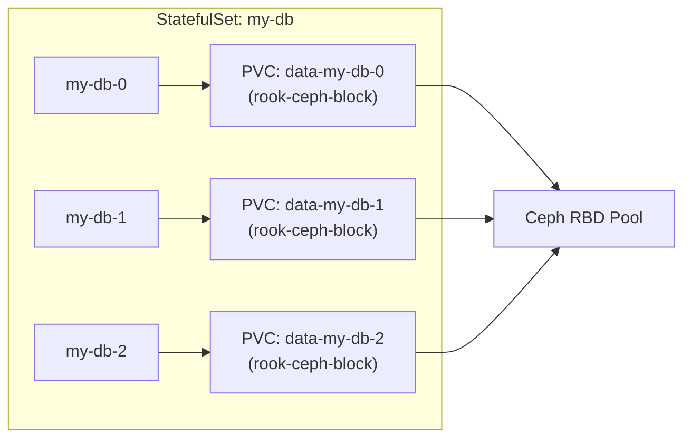

# How to Use Rook-Ceph with StatefulSet Applications

Author: [nawazdhandala](https://www.github.com/nawazdhandala)

Tags: Rook, Ceph, Kubernetes, StatefulSet, Storage, Persistent Volume

Description: Configure Rook-Ceph storage for Kubernetes StatefulSets using volumeClaimTemplates, ensuring stable storage identity, ordered deployment, and proper scaling behavior.

---

## Why StatefulSets Work Well with Rook-Ceph

StatefulSets provide stable network identifiers and stable persistent storage for stateful applications like databases, message queues, and caches. Rook-Ceph's CSI driver integrates with StatefulSet `volumeClaimTemplates`, giving each pod replica its own dedicated PVC that persists across pod rescheduling and cluster restarts.



## Basic StatefulSet with Rook-Ceph Block Storage

A StatefulSet with `volumeClaimTemplates` automatically creates a PVC per replica using the specified StorageClass:

```yaml
apiVersion: apps/v1
kind: StatefulSet
metadata:
  name: my-db
spec:
  serviceName: my-db
  replicas: 3
  selector:
    matchLabels:
      app: my-db
  template:
    metadata:
      labels:
        app: my-db
    spec:
      containers:
        - name: db
          image: postgres:16
          env:
            - name: POSTGRES_PASSWORD
              valueFrom:
                secretKeyRef:
                  name: db-secret
                  key: password
            - name: PGDATA
              value: /var/lib/postgresql/data/pgdata
          volumeMounts:
            - name: data
              mountPath: /var/lib/postgresql/data
          resources:
            requests:
              cpu: "500m"
              memory: "1Gi"
            limits:
              cpu: "2"
              memory: "4Gi"
  volumeClaimTemplates:
    - metadata:
        name: data
      spec:
        accessModes:
          - ReadWriteOnce
        storageClassName: rook-ceph-block
        resources:
          requests:
            storage: 50Gi
```

Apply it:

```bash
kubectl apply -f statefulset.yaml
```

Watch PVCs get created per replica:

```bash
kubectl get pvc | grep data-my-db
```

Expected output:

```text
data-my-db-0   Bound   pvc-abc   50Gi   RWO   rook-ceph-block
data-my-db-1   Bound   pvc-def   50Gi   RWO   rook-ceph-block
data-my-db-2   Bound   pvc-ghi   50Gi   RWO   rook-ceph-block
```

## Headless Service for StatefulSet DNS

StatefulSets require a headless Service for stable DNS names:

```yaml
apiVersion: v1
kind: Service
metadata:
  name: my-db
spec:
  clusterIP: None
  selector:
    app: my-db
  ports:
    - name: postgres
      port: 5432
```

Each pod gets a DNS name: `my-db-0.my-db.default.svc.cluster.local`.

## Scaling StatefulSets

Scale up and Rook-Ceph automatically creates new PVCs:

```bash
kubectl scale statefulset my-db --replicas=5
```

Watch the new PVCs being provisioned:

```bash
kubectl get pvc -w | grep data-my-db
```

Scale down does NOT delete PVCs by default - this protects data:

```bash
kubectl scale statefulset my-db --replicas=1
```

The PVCs for pods 1-4 remain. When you scale back up, the same PVCs are reattached to the same pod names.

## Using CephFS for Shared StatefulSet Storage

Some StatefulSets (like distributed file systems or shared caches) need shared storage. Use CephFS with ReadWriteMany:

```yaml
apiVersion: apps/v1
kind: StatefulSet
metadata:
  name: shared-app
spec:
  serviceName: shared-app
  replicas: 3
  selector:
    matchLabels:
      app: shared-app
  template:
    metadata:
      labels:
        app: shared-app
    spec:
      containers:
        - name: app
          image: myapp:latest
          volumeMounts:
            - name: shared-data
              mountPath: /shared
  volumeClaimTemplates:
    - metadata:
        name: shared-data
      spec:
        accessModes:
          - ReadWriteMany
        storageClassName: rook-cephfs
        resources:
          requests:
            storage: 10Gi
```

Note: Even with ReadWriteMany, each pod gets a separate PVC (and thus separate subvolume) in this configuration.

## Pod Disruption Budget for Stateful Applications

Protect StatefulSet replicas from simultaneous eviction during node maintenance:

```yaml
apiVersion: policy/v1
kind: PodDisruptionBudget
metadata:
  name: my-db-pdb
spec:
  minAvailable: 2
  selector:
    matchLabels:
      app: my-db
```

This ensures at least 2 out of 3 replicas are always available during voluntary disruptions.

## StorageClass Optimization for StatefulSets

Create a StatefulSet-optimized StorageClass that uses a dedicated Ceph pool:

```yaml
apiVersion: ceph.rook.io/v1
kind: CephBlockPool
metadata:
  name: statefulset-pool
  namespace: rook-ceph
spec:
  failureDomain: host
  replicated:
    size: 3
    requireSafeReplicaSize: true
---
apiVersion: storage.k8s.io/v1
kind: StorageClass
metadata:
  name: rook-ceph-statefulset
provisioner: rook-ceph.rbd.csi.ceph.com
parameters:
  clusterID: rook-ceph
  pool: statefulset-pool
  imageFormat: "2"
  imageFeatures: layering
  csi.storage.k8s.io/provisioner-secret-name: rook-csi-rbd-provisioner
  csi.storage.k8s.io/provisioner-secret-namespace: rook-ceph
  csi.storage.k8s.io/controller-expand-secret-name: rook-csi-rbd-provisioner
  csi.storage.k8s.io/controller-expand-secret-namespace: rook-ceph
  csi.storage.k8s.io/node-stage-secret-name: rook-csi-rbd-node
  csi.storage.k8s.io/node-stage-secret-namespace: rook-ceph
reclaimPolicy: Retain
allowVolumeExpansion: true
```

Using `reclaimPolicy: Retain` ensures data is not automatically deleted when a PVC is released.

## Handling PVC Cleanup

When decommissioning a StatefulSet, manually delete PVCs after verifying data is no longer needed:

```bash
kubectl delete statefulset my-db
kubectl get pvc | grep data-my-db
# Review and then delete:
kubectl delete pvc data-my-db-0 data-my-db-1 data-my-db-2
```

If the StorageClass uses `reclaimPolicy: Retain`, also delete the now-Released PVs:

```bash
kubectl get pv | grep Released
kubectl delete pv <pv-name>
```

## Summary

Rook-Ceph integrates seamlessly with StatefulSets through `volumeClaimTemplates`, providing each pod with a dedicated, stable PVC backed by Ceph RBD. PVCs persist independently from pod lifecycle and are reattached when pods are rescheduled. For databases and stateful services, use `reclaimPolicy: Retain` to protect data, configure PodDisruptionBudgets to prevent simultaneous eviction, and use dedicated Ceph pools for isolation. CephFS with ReadWriteMany is available for workloads that need shared filesystem access across replicas.
