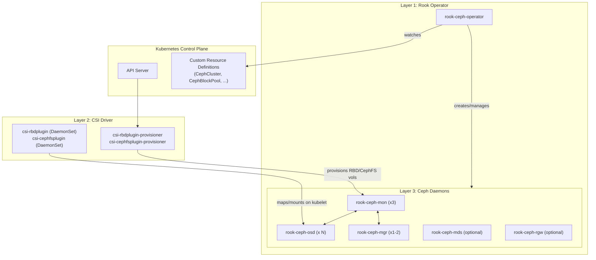
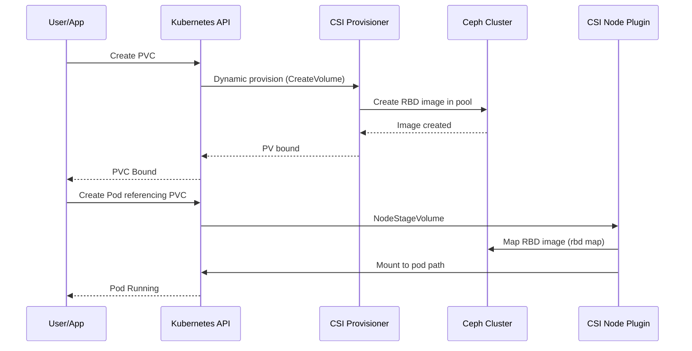

# How to Understand Rook Storage Architecture (Operator, CSI, Daemon)

Author: [nawazdhandala](https://www.github.com/nawazdhandala)

Tags: Rook, Ceph, Kubernetes, Architecture, Storage, CSI

Description: Understand the three-layer Rook-Ceph architecture covering the Rook operator, CSI driver layer, and Ceph daemon layer including how they interact to provide persistent storage.

---

## Three-Layer Architecture Overview

Rook-Ceph is composed of three distinct layers, each with a specific role:

1. **Rook Operator** - Watches Kubernetes CRDs and reconciles the desired Ceph state
2. **CSI Drivers** - Handle volume provisioning, attachment, and mounting for Kubernetes workloads
3. **Ceph Daemon Layer** - The actual storage cluster processes (MON, OSD, MGR, MDS, RGW)



## Layer 1: Rook Operator

The Rook operator is a single Deployment running in the `rook-ceph` namespace. Its job is to:

- Watch Rook CRDs (CephCluster, CephBlockPool, CephFilesystem, CephObjectStore, etc.)
- Translate CRD specs into Ceph configuration and pod manifests
- Deploy and update Mon, OSD, MGR, MDS, and RGW pods
- Handle failure recovery (Mon quorum restoration, OSD replace)
- Manage Ceph cluster upgrades

```bash
kubectl -n rook-ceph get deploy rook-ceph-operator
kubectl -n rook-ceph logs deploy/rook-ceph-operator --tail=30
```

The operator uses Kubernetes controller-runtime and reconciles state continuously. It does not store any data; the cluster state lives in Mon keyring files on `dataDirHostPath`.

## Layer 2: CSI Drivers

Rook deploys two sets of CSI components:

**Provisioner** (runs as Deployments, not on every node):
- `csi-rbdplugin-provisioner` - Creates and deletes RBD (block) volumes
- `csi-cephfsplugin-provisioner` - Creates and deletes CephFS subvolumes

**Node Plugin** (runs as DaemonSets on every node):
- `csi-rbdplugin` - Maps RBD images and mounts them to pods on each node
- `csi-cephfsplugin` - Mounts CephFS subvolumes to pods on each node

```bash
kubectl -n rook-ceph get ds | grep csi
kubectl -n rook-ceph get deploy | grep csi
```

When a PVC is created with a Rook StorageClass, the Provisioner creates the RBD image or CephFS subvolume, and when a Pod is scheduled, the Node Plugin maps/mounts the volume on that node.

## Layer 3: Ceph Daemons

The Ceph daemon layer runs the actual storage processes. Each daemon type has a specific role:

| Daemon | Role | Default Count |
|---|---|---|
| MON | Maintains cluster map and quorum | 3 (always odd) |
| OSD | Stores data on block devices | 1 per disk |
| MGR | Metrics, dashboard, orchestration | 1-2 |
| MDS | Metadata server for CephFS | 2 (active+standby) |
| RGW | S3/Swift-compatible object gateway | configurable |

```bash
kubectl -n rook-ceph get pods -l app=rook-ceph-mon
kubectl -n rook-ceph get pods -l app=rook-ceph-osd
kubectl -n rook-ceph get pods -l app=rook-ceph-mgr
```

## How a PVC Request Flows Through the Layers



## Operator ConfigMap for Global Settings

The Rook operator reads settings from a ConfigMap:

```bash
kubectl -n rook-ceph get configmap rook-ceph-operator-config -o yaml
```

Key settings:

```yaml
data:
  ROOK_LOG_LEVEL: INFO
  ROOK_ENABLE_DISCOVERY_DAEMON: "true"
  CSI_RBD_FSGROUPPOLICY: File
  CSI_CEPHFS_FSGROUPPOLICY: File
  ROOK_OBC_WATCH_OPERATOR_NAMESPACE: "true"
```

## Summary

Rook-Ceph uses a three-layer architecture: the operator watches CRDs and deploys Ceph daemons, the CSI driver layer handles volume provisioning and node mounting, and the Ceph daemon layer (MON, OSD, MGR, MDS, RGW) performs actual storage operations. Understanding this separation helps diagnose issues - operator problems appear in the operator pod logs, provisioning failures appear in CSI provisioner logs, and cluster health issues appear in Ceph daemon logs accessed via the toolbox.
