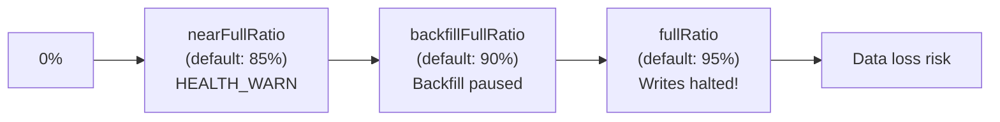

# How to Set Storage Ratios in Rook-Ceph (fullRatio, nearFullRatio)

Author: [nawazdhandala](https://www.github.com/nawazdhandala)

Tags: Rook, Ceph, Kubernetes, Storage, Capacity, Configuration

Description: Configure fullRatio, backfillFullRatio, and nearFullRatio in Rook-Ceph to control cluster capacity thresholds that trigger health warnings, stop backfill, and halt writes.

---

## Why Storage Ratios Matter

Ceph monitors cluster capacity and uses three thresholds to manage behavior as storage fills up:

1. **nearFullRatio** - Cluster health degrades to HEALTH_WARN
2. **backfillFullRatio** - OSD backfill (recovery) is paused to preserve capacity
3. **fullRatio** - OSDs stop accepting writes (cluster halts to prevent data loss)

Setting these correctly prevents unexpected write failures and gives operators time to respond to capacity issues.



## Default Values

Ceph defaults:
- `nearFullRatio`: 0.85 (85%)
- `backfillFullRatio`: 0.90 (90%)
- `fullRatio`: 0.95 (95%)

Rook inherits these defaults unless overridden.

## Configuring Ratios in CephCluster

```yaml
apiVersion: ceph.rook.io/v1
kind: CephCluster
metadata:
  name: rook-ceph
  namespace: rook-ceph
spec:
  cephVersion:
    image: quay.io/ceph/ceph:v19.2.0
  dataDirHostPath: /var/lib/rook
  storage:
    useAllNodes: false
    useAllDevices: false
    fullRatio: 0.95
    backfillFullRatio: 0.90
    nearFullRatio: 0.85
    nodes:
      - name: storage-node-1
        devices:
          - name: sdb
      - name: storage-node-2
        devices:
          - name: sdb
      - name: storage-node-3
        devices:
          - name: sdb
```

These values must satisfy: `nearFullRatio < backfillFullRatio < fullRatio <= 1.0`

## Conservative Settings for Production

For production clusters where you want earlier warnings:

```yaml
spec:
  storage:
    nearFullRatio: 0.75
    backfillFullRatio: 0.80
    fullRatio: 0.85
```

This provides a larger buffer between the warning and write-halt states, giving the operations team more time to add capacity or delete data.

## Checking Current Ratios

```bash
kubectl -n rook-ceph exec -it deploy/rook-ceph-tools -- \
  ceph osd dump | grep -E "full_ratio|backfillfull_ratio|nearfull_ratio"
```

Expected output:

```
full_ratio 0.95
backfillfull_ratio 0.9
nearfull_ratio 0.85
```

## Checking Current Usage

```bash
kubectl -n rook-ceph exec -it deploy/rook-ceph-tools -- \
  ceph df
```

Pay attention to `%USED` for `TOTAL` at the bottom. When this approaches `nearFullRatio`, take action.

Per-OSD capacity:

```bash
kubectl -n rook-ceph exec -it deploy/rook-ceph-tools -- \
  ceph osd df tree
```

## Prometheus Alerts for Capacity

The built-in Ceph PrometheusRules include capacity alerts:

```yaml
- alert: CephClusterNearFull
  expr: ceph_cluster_total_used_bytes / ceph_cluster_total_bytes > 0.85
  for: 5m
  labels:
    severity: warning
  annotations:
    summary: "Ceph cluster is nearing capacity (>85%)"

- alert: CephClusterFull
  expr: ceph_cluster_total_used_bytes / ceph_cluster_total_bytes > 0.95
  for: 1m
  labels:
    severity: critical
  annotations:
    summary: "Ceph cluster is full - writes may be halted"
```

These alert thresholds should be aligned with your configured ratios.

## Updating Ratios at Runtime

You can update ratios without restarting Ceph using the toolbox:

```bash
kubectl -n rook-ceph exec -it deploy/rook-ceph-tools -- \
  ceph osd set-nearfull-ratio 0.80

kubectl -n rook-ceph exec -it deploy/rook-ceph-tools -- \
  ceph osd set-backfillfull-ratio 0.85

kubectl -n rook-ceph exec -it deploy/rook-ceph-tools -- \
  ceph osd set-full-ratio 0.90
```

To persist these changes through Rook reconciliation, also update the CephCluster spec.

## Recovering from a Full Cluster

If the cluster has hit `fullRatio` and writes are halted:

```bash
# Check current state
kubectl -n rook-ceph exec -it deploy/rook-ceph-tools -- \
  ceph health detail

# Temporarily raise fullRatio to allow cleanup
kubectl -n rook-ceph exec -it deploy/rook-ceph-tools -- \
  ceph osd set-full-ratio 0.98

# Delete unneeded data (PVCs, RBD snapshots, etc.)
kubectl get pvc -A | grep -v Bound

# Once usage drops, restore the ratio
kubectl -n rook-ceph exec -it deploy/rook-ceph-tools -- \
  ceph osd set-full-ratio 0.95
```

## Summary

Configure `storage.fullRatio`, `storage.backfillFullRatio`, and `storage.nearFullRatio` in the CephCluster spec to control Ceph's capacity thresholds. Production clusters should use conservative values like `nearFullRatio: 0.75` to provide early warning before writes halt. Monitor usage with `ceph df` and the built-in Prometheus capacity alerts. Update ratios at runtime via `ceph osd set-nearfull-ratio` and persist changes in the CephCluster spec. Recovering from a full cluster requires temporarily raising `fullRatio`, deleting unneeded data, and then restoring the ratio.
