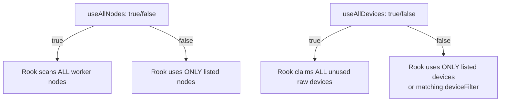

# How to Configure Storage Selection (useAllNodes, useAllDevices) in Rook

Author: [nawazdhandala](https://www.github.com/nawazdhandala)

Tags: Rook, Ceph, Kubernetes, Storage, OSD, Configuration

Description: Configure the useAllNodes and useAllDevices settings in the Rook CephCluster CRD to control which nodes and block devices are used for OSD provisioning.

---

## Storage Selection Overview

The `spec.storage` section of the CephCluster CRD has two key boolean flags that control automatic device discovery:

- `useAllNodes` - Let Rook use every eligible Kubernetes worker node for OSDs
- `useAllDevices` - Let Rook claim every raw block device it discovers on eligible nodes

Understanding these flags is critical to preventing Rook from accidentally consuming OS disks or disks used by other workloads.



## useAllNodes: true (Automatic Node Discovery)

When set to `true`, Rook deploys OSDs on every node that:
- Is a Kubernetes worker node (not a control-plane node unless tolerated)
- Has an eligible raw block device
- Does not have a `ceph-osd-preexist` taint

```yaml
spec:
  storage:
    useAllNodes: true
    useAllDevices: false
    deviceFilter: "^sd[b-z]"
```

This is convenient for homogeneous clusters where all workers have the same disk layout. Combine with `deviceFilter` to prevent claiming the OS disk.

## useAllNodes: false (Explicit Node List)

When set to `false`, Rook only provisions OSDs on nodes explicitly listed in the `nodes` array:

```yaml
spec:
  storage:
    useAllNodes: false
    useAllDevices: false
    nodes:
      - name: storage-node-1
        devices:
          - name: sdb
          - name: sdc
      - name: storage-node-2
        devices:
          - name: sdb
          - name: sdc
      - name: storage-node-3
        devices:
          - name: sdb
          - name: sdc
```

This is the recommended approach for production clusters to maintain explicit control.

## useAllDevices: true (Automatic Device Discovery)

When `useAllDevices: true`, Rook scans each eligible node for raw block devices (no filesystem, no partition table) and provisions an OSD on each one:

```yaml
spec:
  storage:
    useAllNodes: true
    useAllDevices: true
```

Rook determines a device is eligible if:
- It has no filesystem
- It has no partition table
- It is not mounted
- It is not the root disk

On OS images that use entire disks for the OS (e.g., bare metal servers with a single NVMe), `useAllDevices: true` would claim the OS disk if it detects it as raw (unusual but possible on some configurations).

## useAllDevices: false with deviceFilter

Combine `useAllDevices: false` with a regex filter to claim only specific devices:

```yaml
spec:
  storage:
    useAllNodes: true
    useAllDevices: false
    deviceFilter: "^nvme[1-9]n1"
```

This regex claims all NVMe devices except `nvme0n1` (typically the OS disk).

Common device filter patterns:

| Pattern | Matches |
|---|---|
| `^sd[b-z]` | sdb, sdc, sdd... (not sda) |
| `^nvme[1-9]n1` | nvme1n1, nvme2n1... (not nvme0n1) |
| `^vd[b-z]` | vdb, vdc... (VirtIO disks, not vda) |
| `^xvd[b-z]` | xvdb, xvdc... (AWS Xen volumes, not xvda) |

## Combining Node and Device Selection

```yaml
spec:
  storage:
    useAllNodes: false
    useAllDevices: false
    config:
      osdsPerDevice: "1"
    nodes:
      - name: worker-1
        deviceFilter: "^nvme[1-9]n1"
      - name: worker-2
        devices:
          - name: nvme1n1
          - name: nvme2n1
```

Per-node `deviceFilter` overrides the global filter for that specific node.

## osdsPerDevice

Create multiple OSDs from a single device (not recommended for production):

```yaml
spec:
  storage:
    useAllNodes: false
    useAllDevices: false
    config:
      osdsPerDevice: "2"
    nodes:
      - name: storage-node-1
        devices:
          - name: sdb
```

Setting `osdsPerDevice: "2"` creates 2 OSDs from `/dev/sdb` by partitioning it. This is mainly used in testing to simulate more OSDs with fewer physical disks.

## Verifying Device Discovery

Use the OSD discovery DaemonSet to see which devices Rook would claim:

```bash
kubectl -n rook-ceph get pods -l app=rook-discover
kubectl -n rook-ceph logs -l app=rook-discover --tail=20
```

## Summary

`useAllNodes: true` and `useAllDevices: true` are convenient for homogeneous test clusters but risk claiming unintended devices. For production, use `useAllNodes: false` with an explicit `nodes` list and `useAllDevices: false` with either an explicit `devices` list or a `deviceFilter` regex to precisely control which nodes and disks Rook provisions OSDs on. A safe default filter is `^sd[b-z]` for SATA/SAS or `^nvme[1-9]n1` for NVMe to exclude the first disk (typically the OS boot disk).
