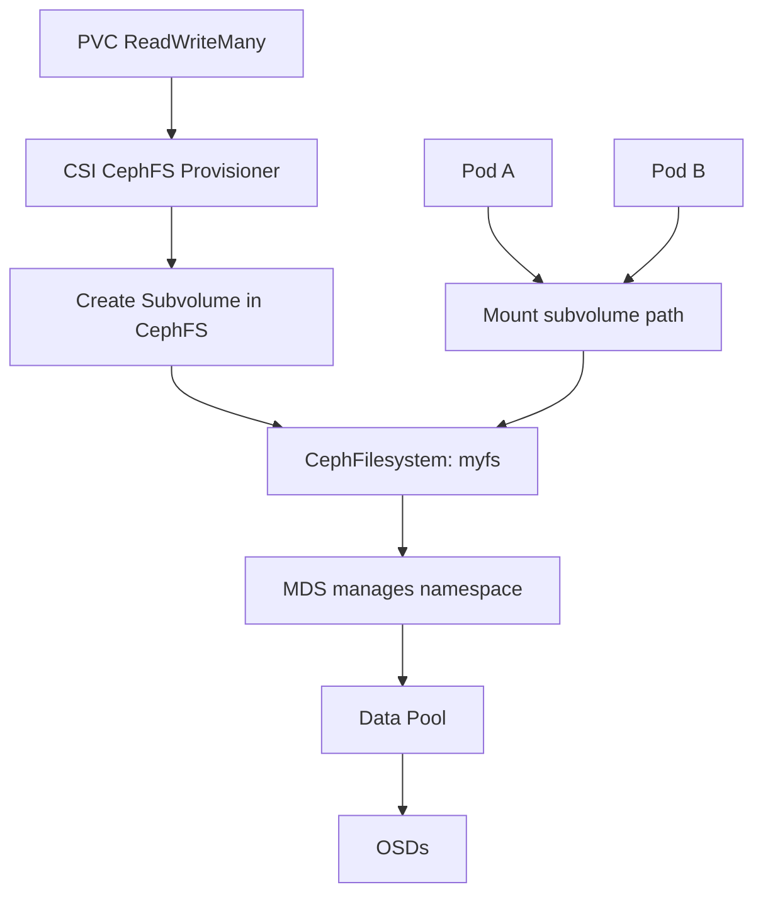

# How to Create a StorageClass for CephFS in Rook

Author: [nawazdhandala](https://www.github.com/nawazdhandala)

Tags: Rook, Ceph, Kubernetes, CephFS, StorageClass, SharedStorage

Description: Configure a Kubernetes StorageClass backed by Rook-Ceph CephFS to enable ReadWriteMany persistent volumes for workloads requiring shared file access.

---

## How CephFS StorageClass Provisioning Works

A CephFS StorageClass uses the Ceph CSI driver with the CephFS provisioner. Unlike RBD which maps block devices, the CephFS CSI driver creates a subvolume within the CephFilesystem for each PVC. Each subvolume is an isolated directory tree with its own quota, while all subvolumes share the underlying Ceph data pools.



## Prerequisites

Before creating the StorageClass:

- A CephFilesystem CR exists and MDS pods are running
- CSI CephFS secrets are present in the `rook-ceph` namespace

Verify:

```bash
# Check filesystem is ready
kubectl -n rook-ceph get cephfilesystem myfs

# Check CSI secrets
kubectl -n rook-ceph get secret rook-csi-cephfs-provisioner rook-csi-cephfs-node

# Check CSI pods
kubectl -n rook-ceph get pods -l app=csi-cephfsplugin
```

## Standard CephFS StorageClass

Create a StorageClass that provisions subvolumes in the `myfs` filesystem:

```yaml
apiVersion: storage.k8s.io/v1
kind: StorageClass
metadata:
  name: rook-cephfs
provisioner: rook-ceph.cephfs.csi.ceph.com
parameters:
  # The Rook namespace where the cluster lives
  clusterID: rook-ceph
  # The CephFilesystem name
  fsName: myfs
  # The pool within the filesystem to use for new volumes
  pool: myfs-replicated
  # Root path within the filesystem (subvolumes are created here)
  rootPath: /volumes
  # Provisioner secret
  csi.storage.k8s.io/provisioner-secret-name: rook-csi-cephfs-provisioner
  csi.storage.k8s.io/provisioner-secret-namespace: rook-ceph
  # Controller expand secret
  csi.storage.k8s.io/controller-expand-secret-name: rook-csi-cephfs-provisioner
  csi.storage.k8s.io/controller-expand-secret-namespace: rook-ceph
  # Node stage secret
  csi.storage.k8s.io/node-stage-secret-name: rook-csi-cephfs-node
  csi.storage.k8s.io/node-stage-secret-namespace: rook-ceph
reclaimPolicy: Delete
allowVolumeExpansion: true
volumeBindingMode: Immediate
```

Apply:

```bash
kubectl apply -f storageclass-cephfs.yaml
```

## CephFS StorageClass with Kernel Driver

By default the CephFS CSI driver uses the Ceph FUSE library (`ceph-fuse`). For better performance, you can instruct it to use the kernel CephFS driver:

```yaml
apiVersion: storage.k8s.io/v1
kind: StorageClass
metadata:
  name: rook-cephfs-kernel
provisioner: rook-ceph.cephfs.csi.ceph.com
parameters:
  clusterID: rook-ceph
  fsName: myfs
  pool: myfs-replicated
  # Use the kernel CephFS driver instead of FUSE
  mounter: kernel
  csi.storage.k8s.io/provisioner-secret-name: rook-csi-cephfs-provisioner
  csi.storage.k8s.io/provisioner-secret-namespace: rook-ceph
  csi.storage.k8s.io/controller-expand-secret-name: rook-csi-cephfs-provisioner
  csi.storage.k8s.io/controller-expand-secret-namespace: rook-ceph
  csi.storage.k8s.io/node-stage-secret-name: rook-csi-cephfs-node
  csi.storage.k8s.io/node-stage-secret-namespace: rook-ceph
reclaimPolicy: Delete
allowVolumeExpansion: true
```

The kernel driver requires the `ceph` kernel module to be loaded on every node that mounts CephFS volumes.

## Verifying the StorageClass

```bash
kubectl get storageclass rook-cephfs
```

## Testing with a ReadWriteMany PVC

Create a PVC and two pods that both mount it to test concurrent access:

```yaml
apiVersion: v1
kind: PersistentVolumeClaim
metadata:
  name: shared-data
spec:
  accessModes:
    - ReadWriteMany
  resources:
    requests:
      storage: 10Gi
  storageClassName: rook-cephfs
---
apiVersion: v1
kind: Pod
metadata:
  name: writer-pod
spec:
  containers:
    - name: writer
      image: busybox
      command: ["/bin/sh", "-c", "while true; do date >> /shared/log.txt; sleep 5; done"]
      volumeMounts:
        - name: shared
          mountPath: /shared
  volumes:
    - name: shared
      persistentVolumeClaim:
        claimName: shared-data
---
apiVersion: v1
kind: Pod
metadata:
  name: reader-pod
spec:
  containers:
    - name: reader
      image: busybox
      command: ["/bin/sh", "-c", "while true; do cat /shared/log.txt; sleep 5; done"]
      volumeMounts:
        - name: shared
          mountPath: /shared
  volumes:
    - name: shared
      persistentVolumeClaim:
        claimName: shared-data
```

```bash
kubectl apply -f rwx-test.yaml
kubectl get pvc shared-data -w
kubectl logs reader-pod
```

## Key Differences Between RBD and CephFS StorageClasses

| Feature | RBD StorageClass | CephFS StorageClass |
|---------|-----------------|---------------------|
| Access mode | ReadWriteOnce | ReadWriteMany |
| Mount method | Block device mapped | POSIX filesystem |
| Multi-pod write | No | Yes |
| Performance | Higher for single writer | Better for concurrent access |
| Use case | Databases, stateful apps | ML datasets, web content, shared configs |

## Summary

A CephFS StorageClass enables `ReadWriteMany` PVCs by using the CephFS CSI provisioner to create subvolumes within an existing CephFilesystem. The key parameters are `fsName` pointing to your CephFilesystem and `pool` pointing to the data pool within it. Use `mounter: kernel` for better performance when the kernel CephFS module is available on all nodes. Test the StorageClass with a multi-pod write/read scenario to confirm concurrent access works before deploying production workloads.
