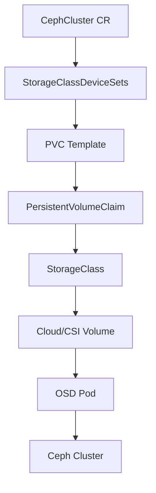

# Configure StorageClassDeviceSets for PVC-Based Clusters in Rook

Author: [nawazdhandala](https://www.github.com/nawazdhandala)

Tags: Rook, Ceph, Kubernetes, Storage, OSD, PVC

Description: Learn how to configure StorageClassDeviceSets in Rook to provision OSD pods backed by PVCs, enabling portable and cloud-native Ceph storage on Kubernetes.

---

When running Rook-Ceph on cloud providers or virtualized environments where raw disks are unavailable, `storageClassDeviceSets` lets you provision OSDs backed by PersistentVolumeClaims. This approach is fully portable, declarative, and works well in autoscaling clusters.

## Architecture



## Prerequisites

- Rook operator installed in the `rook-ceph` namespace
- A StorageClass that supports `ReadWriteOnce` with `Retain` reclaim policy
- Kubernetes 1.21+

## Create a StorageClass for OSD PVCs

Use a storage class that supports block volumes with a `Retain` policy so OSD data survives pod restarts.

```yaml
apiVersion: storage.k8s.io/v1
kind: StorageClass
metadata:
  name: osd-block
provisioner: ebs.csi.aws.com   # replace with your CSI provisioner
parameters:
  type: gp3
  iops: "3000"
  throughput: "125"
reclaimPolicy: Retain
volumeBindingMode: WaitForFirstConsumer
allowVolumeExpansion: true
```

## Configure StorageClassDeviceSets in CephCluster

```yaml
apiVersion: ceph.rook.io/v1
kind: CephCluster
metadata:
  name: rook-ceph
  namespace: rook-ceph
spec:
  dataDirHostPath: /var/lib/rook
  storage:
    storageClassDeviceSets:
      - name: set1
        # number of OSD replicas (one OSD per PVC)
        count: 3
        portable: true
        tuneDeviceClass: true
        tuneFastDeviceClass: false
        encrypted: false
        # schedule OSDs across failure domains
        placement:
          topologySpreadConstraints:
            - maxSkew: 1
              topologyKey: topology.kubernetes.io/zone
              whenUnsatisfiable: DoNotSchedule
              labelSelector:
                matchExpressions:
                  - key: app
                    operator: In
                    values:
                      - rook-ceph-osd
        volumeClaimTemplates:
          - metadata:
              name: data
            spec:
              resources:
                requests:
                  storage: 100Gi
              storageClassName: osd-block
              volumeMode: Block
              accessModes:
                - ReadWriteOnce
```

## Multiple Device Sets for Tiered Storage

You can define separate device sets for different storage tiers:

```yaml
spec:
  storage:
    storageClassDeviceSets:
      - name: ssd-set
        count: 3
        portable: true
        volumeClaimTemplates:
          - metadata:
              name: data
              annotations:
                crushDeviceClass: ssd
            spec:
              resources:
                requests:
                  storage: 200Gi
              storageClassName: ssd-block
              volumeMode: Block
              accessModes:
                - ReadWriteOnce
      - name: hdd-set
        count: 6
        portable: true
        volumeClaimTemplates:
          - metadata:
              name: data
              annotations:
                crushDeviceClass: hdd
            spec:
              resources:
                requests:
                  storage: 2Ti
              storageClassName: hdd-block
              volumeMode: Block
              accessModes:
                - ReadWriteOnce
```

## Using a WAL/DB Device

To separate write-ahead log and metadata onto a faster device, add additional PVC templates:

```yaml
volumeClaimTemplates:
  - metadata:
      name: data
    spec:
      resources:
        requests:
          storage: 2Ti
      storageClassName: hdd-block
      volumeMode: Block
      accessModes:
        - ReadWriteOnce
  - metadata:
      name: metadata
    spec:
      resources:
        requests:
          storage: 50Gi
      storageClassName: ssd-block
      volumeMode: Block
      accessModes:
        - ReadWriteOnce
  - metadata:
      name: wal
    spec:
      resources:
        requests:
          storage: 10Gi
      storageClassName: nvme-block
      volumeMode: Block
      accessModes:
        - ReadWriteOnce
```

## Apply and Verify

```bash
kubectl apply -f cephcluster.yaml -n rook-ceph

# Watch OSD pods being created
kubectl get pods -n rook-ceph -l app=rook-ceph-osd -w

# Check PVCs created for each OSD
kubectl get pvc -n rook-ceph

# Verify OSDs are up in the Ceph toolbox
kubectl exec -n rook-ceph deploy/rook-ceph-tools -- ceph osd tree
```

Expected output:

```
ID  CLASS  WEIGHT   TYPE NAME        STATUS  REWEIGHT
-1         0.29279  root default
-3         0.09760      host node-1
 0    ssd  0.09760          osd.0    up      1.00000
-5         0.09760      host node-2
 1    ssd  0.09760          osd.1    up      1.00000
-7         0.09760      host node-3
 2    ssd  0.09760          osd.2    up      1.00000
```

## Scaling Out

To add more OSDs, increase the `count` field and re-apply:

```yaml
storageClassDeviceSets:
  - name: set1
    count: 6   # was 3
```

```bash
kubectl apply -f cephcluster.yaml -n rook-ceph
kubectl get pods -n rook-ceph -l app=rook-ceph-osd -w
```

## Troubleshooting

```bash
# Check OSD prepare jobs
kubectl get jobs -n rook-ceph -l app=rook-ceph-osd-prepare

# Inspect a failing prepare job
kubectl logs -n rook-ceph job/rook-ceph-osd-prepare-<node> -c provision

# Describe a stuck PVC
kubectl describe pvc -n rook-ceph data-set1-0
```

## Summary

`storageClassDeviceSets` enables PVC-backed OSD provisioning in Rook-Ceph, making it ideal for cloud and virtualized environments. You can define multiple sets for tiered storage, separate WAL/DB devices for performance, and use topology constraints for fault tolerance. Scaling is as simple as incrementing the `count` field and re-applying the manifest.
