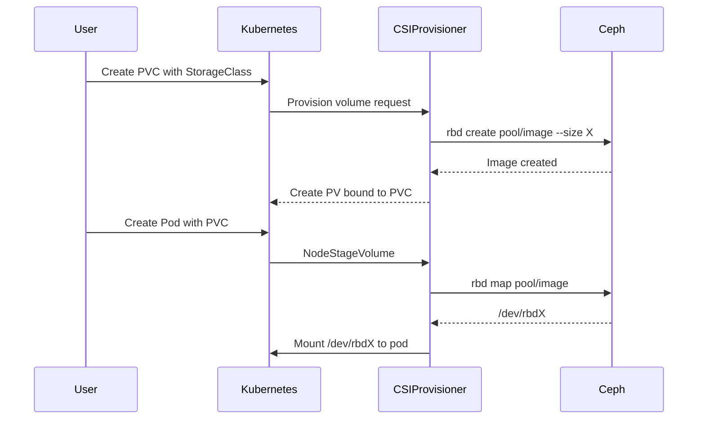

# How to Set Up a StorageClass for Rook-Ceph RBD Volumes

Author: [nawazdhandala](https://www.github.com/nawazdhandala)

Tags: Rook, Ceph, Kubernetes, StorageClass, RBD, CSI

Description: Configure a Kubernetes StorageClass backed by Rook-Ceph RBD to enable dynamic provisioning of persistent block storage volumes.

---

## How Dynamic RBD Provisioning Works

When a PersistentVolumeClaim is created with a StorageClass that uses the Rook CSI RBD provisioner, the CSI driver creates a new RBD image in the designated pool, creates a corresponding PersistentVolume, and binds it to the PVC. When a pod mounts the PVC, the CSI node plugin maps the RBD image to a block device on the node and mounts it.



## Prerequisites

Before creating the StorageClass, ensure:

- A CephBlockPool exists and is healthy
- The CSI RBD secrets (`rook-csi-rbd-provisioner` and `rook-csi-rbd-node`) exist in the `rook-ceph` namespace
- The Rook CSI driver is running

```bash
# Verify the pool exists
kubectl -n rook-ceph get cephblockpool

# Verify CSI secrets
kubectl -n rook-ceph get secret rook-csi-rbd-provisioner rook-csi-rbd-node

# Verify CSI pods are running
kubectl -n rook-ceph get pods -l app=csi-rbdplugin
```

## Standard RBD StorageClass

Create a StorageClass with the standard configuration for production use:

```yaml
apiVersion: storage.k8s.io/v1
kind: StorageClass
metadata:
  name: rook-ceph-block
  annotations:
    # Make this the default StorageClass for the cluster
    storageclass.kubernetes.io/is-default-class: "true"
provisioner: rook-ceph.rbd.csi.ceph.com
parameters:
  # The Rook cluster namespace
  clusterID: rook-ceph
  # The CephBlockPool name
  pool: replicapool
  # RBD image format (must be 2 for modern Ceph features)
  imageFormat: "2"
  # Features required by the CSI driver
  imageFeatures: layering,deep-flatten,exclusive-lock,object-map,fast-diff
  # Provisioner secret for creating/deleting volumes
  csi.storage.k8s.io/provisioner-secret-name: rook-csi-rbd-provisioner
  csi.storage.k8s.io/provisioner-secret-namespace: rook-ceph
  # Secret for expanding volumes online
  csi.storage.k8s.io/controller-expand-secret-name: rook-csi-rbd-provisioner
  csi.storage.k8s.io/controller-expand-secret-namespace: rook-ceph
  # Secret for staging the volume on the node
  csi.storage.k8s.io/node-stage-secret-name: rook-csi-rbd-node
  csi.storage.k8s.io/node-stage-secret-namespace: rook-ceph
  # Filesystem type to format the volume with
  csi.storage.k8s.io/fstype: ext4
reclaimPolicy: Delete
allowVolumeExpansion: true
```

Apply it:

```bash
kubectl apply -f storageclass-rbd.yaml
```

## StorageClass with XFS Filesystem

Some workloads (databases, large sequential writes) perform better on XFS:

```yaml
apiVersion: storage.k8s.io/v1
kind: StorageClass
metadata:
  name: rook-ceph-block-xfs
provisioner: rook-ceph.rbd.csi.ceph.com
parameters:
  clusterID: rook-ceph
  pool: replicapool
  imageFormat: "2"
  imageFeatures: layering,deep-flatten,exclusive-lock,object-map,fast-diff
  csi.storage.k8s.io/provisioner-secret-name: rook-csi-rbd-provisioner
  csi.storage.k8s.io/provisioner-secret-namespace: rook-ceph
  csi.storage.k8s.io/controller-expand-secret-name: rook-csi-rbd-provisioner
  csi.storage.k8s.io/controller-expand-secret-namespace: rook-ceph
  csi.storage.k8s.io/node-stage-secret-name: rook-csi-rbd-node
  csi.storage.k8s.io/node-stage-secret-namespace: rook-ceph
  csi.storage.k8s.io/fstype: xfs
reclaimPolicy: Delete
allowVolumeExpansion: true
```

## StorageClass with Retain Policy

For workloads where data must be preserved after PVC deletion (e.g., database backups), use the `Retain` reclaim policy:

```yaml
apiVersion: storage.k8s.io/v1
kind: StorageClass
metadata:
  name: rook-ceph-block-retain
provisioner: rook-ceph.rbd.csi.ceph.com
parameters:
  clusterID: rook-ceph
  pool: replicapool
  imageFormat: "2"
  imageFeatures: layering,deep-flatten,exclusive-lock,object-map,fast-diff
  csi.storage.k8s.io/provisioner-secret-name: rook-csi-rbd-provisioner
  csi.storage.k8s.io/provisioner-secret-namespace: rook-ceph
  csi.storage.k8s.io/controller-expand-secret-name: rook-csi-rbd-provisioner
  csi.storage.k8s.io/controller-expand-secret-namespace: rook-ceph
  csi.storage.k8s.io/node-stage-secret-name: rook-csi-rbd-node
  csi.storage.k8s.io/node-stage-secret-namespace: rook-ceph
  csi.storage.k8s.io/fstype: ext4
reclaimPolicy: Retain
allowVolumeExpansion: true
```

With `Retain`, you must manually delete the PV and RBD image when done.

## Verifying the StorageClass

After creating the StorageClass, verify it is available and check if it is marked as default:

```bash
kubectl get storageclass
```

```text
NAME                        PROVISIONER                     RECLAIMPOLICY   VOLUMEBINDINGMODE   ALLOWVOLUMEEXPANSION
rook-ceph-block (default)   rook-ceph.rbd.csi.ceph.com     Delete          Immediate           true
rook-ceph-block-retain      rook-ceph.rbd.csi.ceph.com     Retain          Immediate           true
```

## Testing the StorageClass

Create a test PVC to verify dynamic provisioning works:

```yaml
apiVersion: v1
kind: PersistentVolumeClaim
metadata:
  name: test-pvc
spec:
  accessModes:
    - ReadWriteOnce
  resources:
    requests:
      storage: 5Gi
  storageClassName: rook-ceph-block
```

```bash
kubectl apply -f test-pvc.yaml

# Watch the PVC bind
kubectl get pvc test-pvc -w
```

The PVC should transition from `Pending` to `Bound` within 30 seconds:

```text
NAME       STATUS    VOLUME   CAPACITY   ACCESS MODES   STORAGECLASS       AGE
test-pvc   Pending                                      rook-ceph-block    2s
test-pvc   Bound     pvc-abc  5Gi        RWO            rook-ceph-block    8s
```

Clean up after testing:

```bash
kubectl delete pvc test-pvc
```

## Summary

A Rook-Ceph RBD StorageClass connects Kubernetes dynamic provisioning to a CephBlockPool via the CSI driver. The critical parameters are `clusterID`, `pool`, `imageFormat: "2"`, `imageFeatures` with the required feature set, and the three CSI secrets for provisioning, expansion, and node staging. Setting `allowVolumeExpansion: true` lets you grow PVCs without recreating them. Use `reclaimPolicy: Retain` for volumes that must survive PVC deletion, and use separate StorageClasses for different filesystem types or pools when your workloads have different performance requirements.
