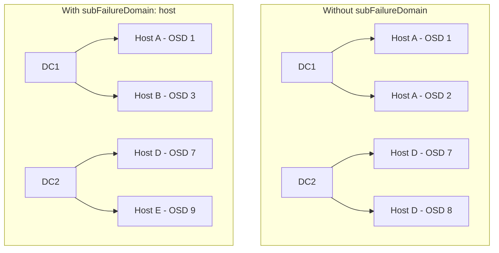

# How to Configure Sub-Failure Domains in Rook Block Pools

Author: [OneUptime](https://www.github.com/oneuptime)

Tags: Rook, Ceph, Kubernetes, Storage

Description: Use subFailureDomain in Rook CephBlockPool to enforce secondary placement constraints and prevent multiple replicas from landing on the same host within a failure domain.

---

## Introduction

When using `replicasPerFailureDomain` greater than 1, Ceph would by default place both replicas within the same failure domain on any 2 OSDs, potentially on the same host. The `subFailureDomain` field prevents this by enforcing a secondary CRUSH constraint within each primary failure domain bucket.

For example, with 2 replicas per datacenter and `subFailureDomain: host`, Ceph guarantees the 2 replicas within each datacenter are placed on different hosts.

## Sub-Failure Domain Placement Logic



## Prerequisites

- Rook-Ceph cluster configured with a multi-level CRUSH hierarchy (e.g., datacenter > rack > host > osd)
- `replicasPerFailureDomain` set to a value greater than 1
- Sufficient nodes within each primary failure domain

## Step 1: Verify the CRUSH Hierarchy

```bash
kubectl -n rook-ceph exec -it deploy/rook-ceph-tools -- bash

# Display the full CRUSH tree
ceph osd tree

# Example output showing hierarchy:
# ID  CLASS  WEIGHT  TYPE       NAME
# -1         10.000  root       default
# -3          5.000    datacenter dc1
# -5          2.500      rack rack1
# -7          1.250        host host1
#  0    hdd   0.625          osd osd.0
#  1    hdd   0.625          osd osd.1
```

## Step 2: Configure CephBlockPool with subFailureDomain

```yaml
# blockpool-sub-failure-domain.yaml
apiVersion: ceph.rook.io/v1
kind: CephBlockPool
metadata:
  name: geo-redundant-pool
  namespace: rook-ceph
spec:
  replicated:
    # 2 replicas per datacenter x 2 datacenters = 4 total
    size: 4
    requireSafeReplicaSize: true
    # Primary failure domain - replicas split across datacenters
    failureDomain: datacenter
    # Number of replicas within each datacenter
    replicasPerFailureDomain: 2
    # Secondary constraint - within each datacenter, replicas on different hosts
    subFailureDomain: host
```

```bash
kubectl apply -f blockpool-sub-failure-domain.yaml
```

## Step 3: Verify the CRUSH Rule Structure

When `subFailureDomain` is set, Rook creates a two-level CRUSH rule:

```bash
kubectl -n rook-ceph exec -it deploy/rook-ceph-tools -- \
  ceph osd crush rule dump geo-redundant-pool

# Expected output will show two "choose" steps:
# { "op": "choose_firstn", "num": 0, "type": "datacenter" }
# { "op": "chooseleaf_firstn", "num": 2, "type": "host" }
```

## Step 4: Common Sub-Failure Domain Combinations

Different deployment topologies call for different combinations:

```yaml
# Rack-level primary, host-level secondary (common for colocation)
spec:
  replicated:
    size: 3
    failureDomain: rack
    replicasPerFailureDomain: 1
    subFailureDomain: host

---
# Zone-level primary, rack-level secondary (regional deployments)
spec:
  replicated:
    size: 4
    failureDomain: zone
    replicasPerFailureDomain: 2
    subFailureDomain: rack

---
# Datacenter-level primary, host-level secondary (two-site HA)
spec:
  replicated:
    size: 4
    failureDomain: datacenter
    replicasPerFailureDomain: 2
    subFailureDomain: host
```

## Step 5: Three-Level CRUSH Hierarchy Setup

For a topology with datacenters, racks, and hosts, configure the CRUSH map accordingly:

```bash
# On the Ceph admin host (outside Kubernetes)

# Add datacenter buckets
ceph osd crush add-bucket dc1 datacenter
ceph osd crush add-bucket dc2 datacenter

# Move racks into datacenters
ceph osd crush move rack1 datacenter=dc1
ceph osd crush move rack2 datacenter=dc1
ceph osd crush move rack3 datacenter=dc2
ceph osd crush move rack4 datacenter=dc2

# Move hosts into racks
ceph osd crush move host1 rack=rack1
ceph osd crush move host2 rack=rack1
ceph osd crush move host3 rack=rack2
ceph osd crush move host4 rack=rack3

# Move dc buckets under root
ceph osd crush move dc1 root=default
ceph osd crush move dc2 root=default

# Verify
ceph osd tree
```

## Step 6: Test Replica Placement

```bash
# Create a test RBD image and check placement
kubectl -n rook-ceph exec -it deploy/rook-ceph-tools -- bash

# Check PG distribution for the pool
ceph pg dump pools | grep geo-redundant-pool

# For a specific PG, check acting OSDs
ceph pg map 3.0

# Map OSD IDs to hosts
ceph osd find 0
ceph osd find 1
```

## Step 7: Monitor PG Health with Sub-Failure Domains

```bash
# Verify no undersized PGs exist
kubectl -n rook-ceph exec -it deploy/rook-ceph-tools -- \
  ceph health detail

# Check if all PGs have the correct number of acting OSDs
kubectl -n rook-ceph exec -it deploy/rook-ceph-tools -- \
  ceph pg stat

# Look for constraint violations
kubectl -n rook-ceph exec -it deploy/rook-ceph-tools -- \
  ceph osd pool ls detail | grep geo-redundant
```

## Troubleshooting

```bash
# Error: "not enough hosts in datacenter dc1 to satisfy subFailureDomain: host"
# Solution: Add more hosts to each primary failure domain

# Check how many hosts exist per datacenter
kubectl -n rook-ceph exec -it deploy/rook-ceph-tools -- \
  ceph osd tree | grep -A20 "datacenter dc1"

# If using Rook-managed cluster, check CephCluster for node placement
kubectl describe cephcluster rook-ceph -n rook-ceph | grep -A20 "Placement"

# Adjust replicasPerFailureDomain to match available hosts
# If only 1 host per datacenter, replicasPerFailureDomain must be 1
```

## Summary

The `subFailureDomain` field in CephBlockPool provides a secondary CRUSH placement constraint that ensures replicas within a primary failure domain are distributed across sub-buckets. Combined with `replicasPerFailureDomain`, this enables sophisticated placement policies like "2 replicas per datacenter, each on a different host." The CRUSH hierarchy must have sufficient sub-buckets to satisfy the constraint, and Rook automatically generates the appropriate two-level CRUSH rule when both fields are configured.
