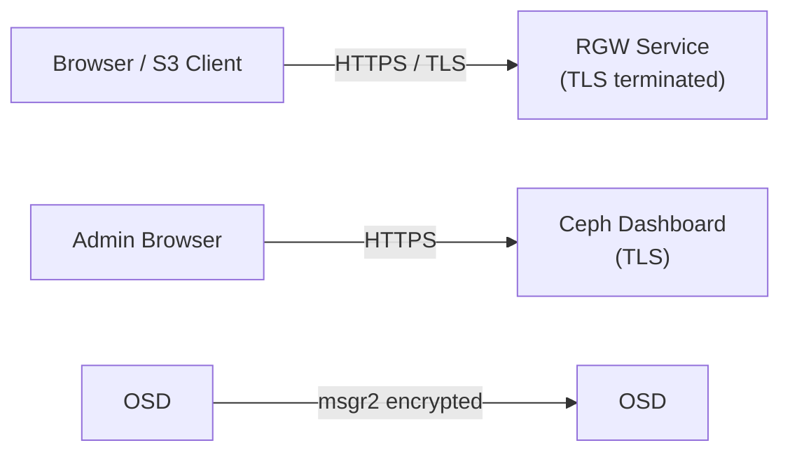

# How to Configure Rook-Ceph TLS for Secure Communication

Author: [nawazdhandala](https://www.github.com/nawazdhandala)

Tags: Rook, Ceph, Kubernetes, TLS, Security, Storage, Certificate

Description: Configure TLS certificates for Rook-Ceph components including the Ceph Dashboard, RGW object store, and inter-daemon communication using cert-manager or manual certificates.

---

## TLS in Rook-Ceph

Rook-Ceph supports TLS for several components: the Ceph MGR Dashboard (web UI), the RGW object store S3 endpoint, and inter-daemon communication via Ceph msgr2. Securing these endpoints prevents eavesdropping and ensures authenticity of connections.



## Prerequisites

- cert-manager installed in the cluster (optional but recommended for automated cert rotation)
- `kubectl` access to the rook-ceph namespace
- A domain name or IP SAN for RGW and Dashboard certificates

Install cert-manager if not present:

```bash
kubectl apply -f https://github.com/cert-manager/cert-manager/releases/latest/download/cert-manager.yaml
```

## Step 1 - Configure Ceph Dashboard with TLS

Enable TLS for the Ceph Dashboard in the CephCluster spec:

```yaml
apiVersion: ceph.rook.io/v1
kind: CephCluster
metadata:
  name: rook-ceph
  namespace: rook-ceph
spec:
  dashboard:
    enabled: true
    ssl: true
    port: 8443
```

By default, Rook generates a self-signed certificate for the Dashboard. To use a custom certificate, create a TLS secret and reference it:

```bash
kubectl -n rook-ceph create secret tls dashboard-tls \
  --cert=dashboard.crt \
  --key=dashboard.key
```

Then reference it in the CephCluster:

```yaml
spec:
  dashboard:
    enabled: true
    ssl: true
    urlPrefix: /
    sslCertificateRef: dashboard-tls
```

## Step 2 - Configure RGW with TLS

For the RGW object store, configure TLS in the CephObjectStore spec.

First, create a TLS certificate secret. Using cert-manager, create a Certificate resource:

```yaml
apiVersion: cert-manager.io/v1
kind: Certificate
metadata:
  name: rgw-tls-cert
  namespace: rook-ceph
spec:
  secretName: rgw-tls-secret
  issuerRef:
    name: letsencrypt-prod
    kind: ClusterIssuer
  dnsNames:
    - s3.example.com
  ipAddresses:
    - 192.168.1.100
```

Or create a self-signed certificate for testing:

```bash
openssl req -x509 -nodes -days 365 -newkey rsa:2048 \
  -keyout rgw.key \
  -out rgw.crt \
  -subj "/CN=s3.example.com/O=MyOrg" \
  -addext "subjectAltName=DNS:s3.example.com,IP:192.168.1.100"

kubectl -n rook-ceph create secret tls rgw-tls-secret \
  --cert=rgw.crt \
  --key=rgw.key
```

Reference the TLS secret in the CephObjectStore:

```yaml
apiVersion: ceph.rook.io/v1
kind: CephObjectStore
metadata:
  name: my-store
  namespace: rook-ceph
spec:
  metadataPool:
    replicated:
      size: 3
  dataPool:
    replicated:
      size: 3
  gateway:
    port: 80
    securePort: 443
    instances: 2
    sslCertificateRef: rgw-tls-secret
```

Verify the RGW service exposes both ports:

```bash
kubectl -n rook-ceph get svc rook-ceph-rgw-my-store
```

## Step 3 - Enable Ceph Messenger v2 with Encryption

Enable encrypted inter-daemon communication using Ceph's msgr2 protocol:

```yaml
apiVersion: ceph.rook.io/v1
kind: CephCluster
metadata:
  name: rook-ceph
  namespace: rook-ceph
spec:
  network:
    connections:
      requireMsgr2: true
      encryption:
        enabled: true
      compression:
        enabled: false
```

`requireMsgr2: true` forces all Ceph daemons to use the v2 protocol, rejecting v1 connections.

Verify msgr2 is in use:

```bash
kubectl -n rook-ceph exec -it deploy/rook-ceph-tools -- \
  ceph config get global ms_bind_msgr2
```

Check that daemons are listening on port 3300 (msgr2) instead of 6789 (msgr1):

```bash
kubectl -n rook-ceph exec -it deploy/rook-ceph-tools -- \
  ceph mon dump | grep addr
```

## Step 4 - Configure CephFS with TLS (MDS)

Enable TLS for MDS connections in the CephFilesystem:

```yaml
apiVersion: ceph.rook.io/v1
kind: CephFilesystem
metadata:
  name: myfs
  namespace: rook-ceph
spec:
  metadataPool:
    replicated:
      size: 3
  dataPools:
    - name: replicated
      replicated:
        size: 3
  metadataServer:
    activeCount: 1
    activeStandby: true
```

The MDS uses the cluster-level msgr2 encryption when `requireMsgr2: true` is set at the CephCluster level.

## Step 5 - Automate Certificate Rotation with cert-manager

Create a cert-manager Issuer and Certificate for the Dashboard with automatic renewal:

```yaml
apiVersion: cert-manager.io/v1
kind: Issuer
metadata:
  name: rook-ceph-selfsigned
  namespace: rook-ceph
spec:
  selfSigned: {}
---
apiVersion: cert-manager.io/v1
kind: Certificate
metadata:
  name: rook-dashboard-cert
  namespace: rook-ceph
spec:
  secretName: dashboard-tls
  issuerRef:
    name: rook-ceph-selfsigned
    kind: Issuer
  commonName: rook-ceph-mgr.rook-ceph.svc
  dnsNames:
    - rook-ceph-mgr.rook-ceph.svc
    - rook-ceph-mgr.rook-ceph.svc.cluster.local
  duration: 8760h
  renewBefore: 720h
```

cert-manager automatically renews the certificate before it expires. Rook watches the secret and reloads the certificate without downtime.

## Verifying TLS Configuration

Test the RGW HTTPS endpoint:

```bash
RGW_IP=$(kubectl -n rook-ceph get svc rook-ceph-rgw-my-store -o jsonpath='{.spec.clusterIP}')
curl -k https://$RGW_IP/
```

The `-k` flag skips certificate verification for self-signed certs. For production, remove `-k` and use a CA-signed certificate.

Check Dashboard TLS:

```bash
DASHBOARD_IP=$(kubectl -n rook-ceph get svc rook-ceph-mgr-dashboard -o jsonpath='{.spec.clusterIP}')
curl -k https://$DASHBOARD_IP:8443/api/health/ready
```

## Summary

Configuring TLS in Rook-Ceph covers three areas: the Ceph Dashboard (via `dashboard.sslCertificateRef`), the RGW object store (via `gateway.sslCertificateRef`), and inter-daemon communication (via `network.connections.requireMsgr2` and `encryption.enabled`). Use cert-manager for automated certificate lifecycle management to avoid certificate expiry incidents. Combine TLS with OSD encryption and network policies for a comprehensive security posture.
