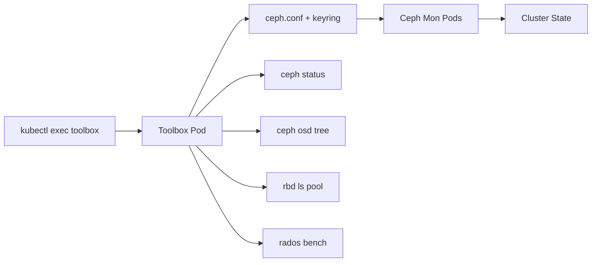

# How to Use the Rook-Ceph Toolbox for Cluster Diagnostics

Author: [nawazdhandala](https://www.github.com/nawazdhandala)

Tags: Rook, Ceph, Kubernetes, Toolbox, Diagnostic, Debugging

Description: Learn how to deploy and use the Rook-Ceph toolbox pod to run Ceph CLI commands for cluster health checks, pool inspection, and performance diagnostics.

---

## What the Rook-Ceph Toolbox Is

The Rook-Ceph toolbox is a pod that contains the full Ceph command-line toolset (`ceph`, `rados`, `rbd`, `ceph-volume`) pre-configured with the credentials needed to communicate with your cluster. Because Ceph daemons run inside Kubernetes pods without direct host access, the toolbox gives you a shell from which you can run any Ceph administrative command.



## Deploying the Toolbox

Deploy the toolbox as a Deployment so it is always available:

```yaml
apiVersion: apps/v1
kind: Deployment
metadata:
  name: rook-ceph-tools
  namespace: rook-ceph
  labels:
    app: rook-ceph-tools
spec:
  replicas: 1
  selector:
    matchLabels:
      app: rook-ceph-tools
  template:
    metadata:
      labels:
        app: rook-ceph-tools
    spec:
      dnsPolicy: ClusterFirstWithHostNet
      containers:
        - name: rook-ceph-tools
          image: quay.io/ceph/ceph:v18.2.0
          command: ["/tini"]
          args: ["-g", "--", "/usr/local/bin/toolbox.sh"]
          imagePullPolicy: IfNotPresent
          env:
            - name: ROOK_CEPH_USERNAME
              valueFrom:
                secretKeyRef:
                  name: rook-ceph-mon
                  key: ceph-username
            - name: ROOK_CEPH_SECRET
              valueFrom:
                secretKeyRef:
                  name: rook-ceph-mon
                  key: ceph-secret
          volumeMounts:
            - mountPath: /etc/ceph
              name: ceph-config
            - name: mon-endpoint-volume
              mountPath: /etc/rook
      volumes:
        - name: mon-endpoint-volume
          configMap:
            name: rook-ceph-mon-endpoints
            items:
              - key: data
                path: mon-endpoints
        - name: ceph-config
          emptyDir: {}
      tolerations:
        - key: "node.kubernetes.io/unreachable"
          operator: "Exists"
          effect: "NoExecute"
          tolerationSeconds: 5
```

Alternatively, if you installed via the `rook-ceph-cluster` Helm chart, enable the toolbox in your values file:

```yaml
toolbox:
  enabled: true
  image: quay.io/ceph/ceph:v18.2.0
```

Apply and wait for the pod to be ready:

```bash
kubectl apply -f toolbox.yaml
kubectl -n rook-ceph rollout status deployment/rook-ceph-tools
```

## Opening a Shell in the Toolbox

Connect to the toolbox pod to run interactive Ceph commands:

```bash
kubectl -n rook-ceph exec -it deploy/rook-ceph-tools -- bash
```

## Essential Ceph Diagnostic Commands

### Cluster Overview

Check the overall cluster health and services:

```bash
ceph status
```

```text
  cluster:
    id:     a0ce9d95-1234-5678-abcd-xxxxxxxxxxxx
    health: HEALTH_OK

  services:
    mon: 3 daemons, quorum a,b,c (age 2h)
    mgr: a(active, since 2h), standbys: b
    osd: 9 osds: 9 up, 9 in

  data:
    pools:   3 pools, 64 pgs
    objects: 842 objects, 2.3 GiB
    usage:   9.2 GiB used, 890 GiB / 900 GiB avail
    pgs:     64 active+clean
```

### OSD Tree and Status

Display the CRUSH hierarchy and OSD locations:

```bash
ceph osd tree
```

```text
ID  CLASS  WEIGHT   TYPE NAME        STATUS  REWEIGHT  PRI-AFF
-1         2.72900  root default
-3         0.90967      host node1
 0    ssd  0.30489          osd.0        up   1.00000  1.00000
 1    ssd  0.30489          osd.1        up   1.00000  1.00000
 2    ssd  0.30489          osd.2        up   1.00000  1.00000
```

Check all OSD states at once:

```bash
ceph osd stat
ceph osd dump | grep "^osd"
```

### Pool Information

List all pools and their usage:

```bash
ceph df
ceph osd pool ls detail
```

Check a specific pool's replication and PG settings:

```bash
ceph osd pool get replicapool all
```

### Monitor Status

Inspect monitor quorum health:

```bash
ceph mon stat
ceph quorum_status --format json-pretty
```

### PG (Placement Group) Health

Check if any placement groups are in a non-clean state:

```bash
ceph pg stat
ceph pg dump_stuck
```

Identify problematic PGs:

```bash
ceph health detail
```

## Performance Diagnostics

### Disk Throughput Benchmark

Run a write benchmark on a specific pool:

```bash
rados bench -p replicapool 30 write --no-cleanup
```

Run a sequential read benchmark:

```bash
rados bench -p replicapool 30 seq
```

Run a random read benchmark:

```bash
rados bench -p replicapool 30 rand
```

Clean up benchmark objects afterward:

```bash
rados -p replicapool cleanup
```

### OSD Performance Statistics

Check per-OSD performance stats:

```bash
ceph osd perf
```

Get detailed perf counters for a specific OSD:

```bash
ceph tell osd.0 perf dump
```

## RBD Commands

List RBD images in a pool:

```bash
rbd ls replicapool
```

Get details about a specific image:

```bash
rbd info replicapool/csi-vol-xxxx
```

List snapshots of an image:

```bash
rbd snap ls replicapool/csi-vol-xxxx
```

## Running Commands Non-Interactively

You can pipe commands directly without opening an interactive shell:

```bash
kubectl -n rook-ceph exec deploy/rook-ceph-tools -- ceph status
kubectl -n rook-ceph exec deploy/rook-ceph-tools -- ceph osd tree
kubectl -n rook-ceph exec deploy/rook-ceph-tools -- ceph df
```

This is useful for scripting health checks in CI pipelines or monitoring scripts.

## Summary

The Rook-Ceph toolbox is an essential debugging aid that gives you full access to the Ceph CLI from within your Kubernetes cluster. Deploy it as a Deployment to keep it always available, then use `kubectl exec` to run `ceph status`, `ceph osd tree`, `ceph pg stat`, and `rados bench` for health checks and performance diagnostics. The toolbox is pre-configured with the correct credentials and ceph.conf, so no manual keyring management is required. For non-interactive use, pipe commands directly to the exec call to integrate Ceph health checks into automation scripts.
