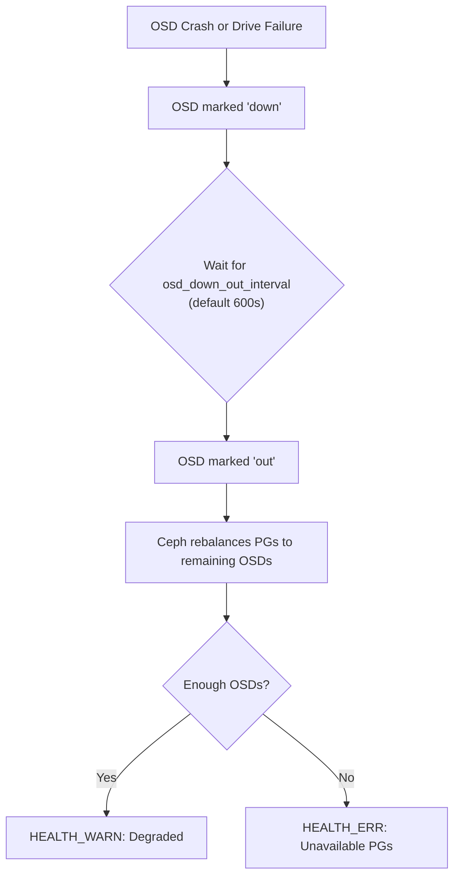

# How to Troubleshoot OSD Failures in Rook-Ceph

Author: [nawazdhandala](https://www.github.com/nawazdhandala)

Tags: Rook, Ceph, Kubernetes, OSD, Troubleshooting, Storage

Description: Diagnose and recover from OSD failures in Rook-Ceph by analyzing pod logs, checking CRUSH maps, replacing failed drives, and restoring cluster health.

---

## How OSD Failures Manifest in Rook-Ceph

OSD (Object Storage Daemon) failures cause data to be unavailable from affected placement groups. Ceph marks the OSD as `down` then `out`, triggering rebalancing to restore the configured replication factor. If too many OSDs fail simultaneously (based on the minimum_size setting), the cluster can become degraded or unavailable.



## Step 1 - Identify the Failed OSD

Check the overall cluster health first:

```bash
kubectl -n rook-ceph exec -it deploy/rook-ceph-tools -- ceph status
```

List OSDs and their states:

```bash
kubectl -n rook-ceph exec -it deploy/rook-ceph-tools -- ceph osd stat
```

Show the OSD tree to see which node and device the failed OSD is on:

```bash
kubectl -n rook-ceph exec -it deploy/rook-ceph-tools -- ceph osd tree
```

Look for OSDs with status `down` in the output.

Get detailed OSD health:

```bash
kubectl -n rook-ceph exec -it deploy/rook-ceph-tools -- ceph health detail
```

## Step 2 - Check the OSD Pod Status

Find the failing OSD pod:

```bash
kubectl -n rook-ceph get pods -l app=rook-ceph-osd | grep -v Running
```

Describe the failing pod for events and error messages:

```bash
kubectl -n rook-ceph describe pod rook-ceph-osd-<id>-<hash>
```

Check the OSD pod logs:

```bash
kubectl -n rook-ceph logs rook-ceph-osd-<id>-<hash> --previous
```

Common log patterns and their meanings:

- `bluestore: _open_db failed` - BlueStore metadata corruption
- `OSD::mkfs: failed to load type` - Disk metadata problem
- `FAILED` in startup logs - Drive hardware failure or removal

## Step 3 - Check the Node and Disk

SSH to the node hosting the failed OSD and check the disk health:

```bash
lsblk
smartctl -a /dev/sdX
dmesg | grep -i error | tail -20
```

Check if the disk is still detected by the kernel:

```bash
ls -la /dev/disk/by-id/ | grep <disk-serial>
```

## Step 4 - Prevent Rebalancing (Optional for Quick Recovery)

If you believe the OSD failure is temporary (node reboot, network issue), prevent Ceph from rebalancing immediately:

```bash
kubectl -n rook-ceph exec -it deploy/rook-ceph-tools -- ceph osd set noout
```

Investigate and resolve the issue, then unset the flag:

```bash
kubectl -n rook-ceph exec -it deploy/rook-ceph-tools -- ceph osd unset noout
```

## Step 5 - Remove and Replace a Failed OSD

If the disk is truly failed, remove the OSD from the cluster.

Mark the OSD as out:

```bash
kubectl -n rook-ceph exec -it deploy/rook-ceph-tools -- \
  ceph osd out osd.<id>
```

Wait for data to rebalance to other OSDs:

```bash
kubectl -n rook-ceph exec -it deploy/rook-ceph-tools -- ceph status
```

Once the cluster reaches `HEALTH_OK` (all PGs active+clean), proceed with removal.

Delete the OSD deployment:

```bash
kubectl -n rook-ceph delete deployment rook-ceph-osd-<id>
```

Remove the OSD from the CRUSH map:

```bash
kubectl -n rook-ceph exec -it deploy/rook-ceph-tools -- \
  ceph osd crush remove osd.<id>
```

Remove the OSD authentication key:

```bash
kubectl -n rook-ceph exec -it deploy/rook-ceph-tools -- \
  ceph auth del osd.<id>
```

Remove the OSD from the OSD map:

```bash
kubectl -n rook-ceph exec -it deploy/rook-ceph-tools -- \
  ceph osd rm osd.<id>
```

Delete the associated PersistentVolumeClaim (if using PVC-based OSDs):

```bash
kubectl -n rook-ceph delete pvc <osd-pvc-name>
```

## Step 6 - Trigger OSD Replacement via Rook

Rook supports automatic OSD replacement. Delete the ConfigMap that tracks the failed OSD to signal Rook to re-provision it on the new disk:

```bash
kubectl -n rook-ceph delete configmap rook-ceph-osd-<id>-osd-prepare-status
```

Or use the Rook OSD remove procedure by annotating the CephCluster:

```bash
kubectl -n rook-ceph annotate cephcluster rook-ceph \
  remove-osd.ceph.rook.io/osd-id="<id>" --overwrite
```

After replacing the physical disk and attaching it, restart the OSD prepare job:

```bash
kubectl -n rook-ceph delete job rook-ceph-osd-prepare-<node-name>
```

Rook will detect the new disk and provision a new OSD.

## Step 7 - Verify Recovery

Monitor the recovery progress:

```bash
watch kubectl -n rook-ceph exec -it deploy/rook-ceph-tools -- ceph status
```

Check that PGs are recovering:

```bash
kubectl -n rook-ceph exec -it deploy/rook-ceph-tools -- ceph pg stat
```

Confirm all OSDs are up and in:

```bash
kubectl -n rook-ceph exec -it deploy/rook-ceph-tools -- ceph osd tree
```

## Summary

Troubleshooting OSD failures in Rook-Ceph involves checking the OSD pod status, logs, and the underlying disk health. For temporary failures, use `ceph osd set noout` to prevent premature rebalancing. For permanent disk failures, follow the remove-and-replace procedure: mark the OSD out, wait for rebalancing, remove it from the CRUSH map and OSD map, replace the disk, and let Rook provision a new OSD. Always verify cluster health returns to `HEALTH_OK` before considering recovery complete.
