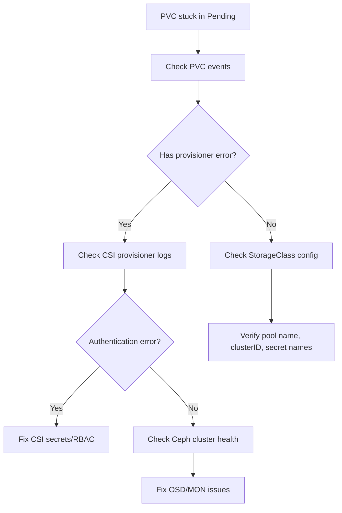

# How to Troubleshoot Pending PVCs in Rook-Ceph

Author: [nawazdhandala](https://www.github.com/nawazdhandala)

Tags: Rook, Ceph, Kubernetes, PVC, Troubleshooting, CSI, Storage

Description: Diagnose and fix PersistentVolumeClaims stuck in Pending state when using Rook-Ceph storage, covering CSI provisioner issues, pool problems, and RBAC errors.

---

## Why PVCs Get Stuck in Pending

A PVC backed by Rook-Ceph can get stuck in `Pending` for several reasons: the CSI provisioner pod is not running, the StorageClass references an incorrect pool or cluster ID, the Ceph cluster is unhealthy, or there are RBAC permission issues. Systematic diagnosis narrows the cause quickly.



## Step 1 - Check PVC Events

The first step is always to describe the PVC and look at the events section:

```bash
kubectl describe pvc <pvc-name> -n <namespace>
```

Look for events like:

```text
Warning  ProvisioningFailed  waiting for a volume to be created, either by external provisioner "rook-ceph.rbd.csi.ceph.com" ...
```

or:

```text
Warning  ProvisioningFailed  failed to provision volume ... error: ...
```

The error message often reveals the root cause directly.

## Step 2 - Verify the CSI Provisioner Pods Are Running

Check that the RBD and CephFS CSI provisioner pods are running:

```bash
kubectl -n rook-ceph get pods | grep csi
```

Expected pods:
- `csi-rbdplugin-provisioner-*` (2 replicas for HA)
- `csi-rbdplugin-*` (DaemonSet on each node)
- `csi-cephfsplugin-provisioner-*`
- `csi-cephfsplugin-*`

If any provisioner pod is not running, describe it:

```bash
kubectl -n rook-ceph describe pod csi-rbdplugin-provisioner-<hash>
```

## Step 3 - Check CSI Provisioner Logs

View the external-provisioner sidecar logs for provisioning errors:

```bash
kubectl -n rook-ceph logs -l app=csi-rbdplugin-provisioner \
  -c csi-provisioner --tail=50
```

For CephFS:

```bash
kubectl -n rook-ceph logs -l app=csi-cephfsplugin-provisioner \
  -c csi-provisioner --tail=50
```

Common error patterns:

- `error creating RBD image: ... auth error` - CSI secrets have wrong keys
- `error fetching storageclass ... key not found` - StorageClass references a non-existent secret
- `timeout waiting for operations to complete` - Ceph cluster is slow or unavailable
- `rbd: error opening pool` - Pool does not exist

## Step 4 - Verify StorageClass Configuration

Check the StorageClass parameters:

```bash
kubectl get storageclass rook-ceph-block -o yaml
```

Verify each field:

The `clusterID` must match the namespace of the Rook-Ceph cluster (usually `rook-ceph`):

```bash
kubectl -n rook-ceph get cephcluster -o jsonpath='{.items[0].metadata.namespace}'
```

The `pool` must exist:

```bash
kubectl -n rook-ceph exec -it deploy/rook-ceph-tools -- ceph osd lspools
```

The secret names must exist in the `rook-ceph` namespace:

```bash
kubectl -n rook-ceph get secrets | grep rook-csi
```

## Step 5 - Verify CSI Secrets Have Correct Keys

Decode and check the provisioner secret:

```bash
kubectl -n rook-ceph get secret rook-csi-rbd-provisioner -o yaml
```

Verify `userID` and `userKey` are present and not empty. The `userKey` should be a valid Ceph keyring (base64-encoded in the secret data).

Test that the key is valid from the tools pod:

```bash
kubectl -n rook-ceph exec -it deploy/rook-ceph-tools -- \
  rbd ls replicapool \
  --id=csi-rbd-provisioner \
  --key=<decoded-userKey>
```

## Step 6 - Check Ceph Cluster Health

A degraded Ceph cluster can block new PVC provisioning:

```bash
kubectl -n rook-ceph exec -it deploy/rook-ceph-tools -- ceph status
```

If the cluster shows `HEALTH_ERR`:

- Check OSD status: `ceph osd stat`
- Check MON status: `ceph mon stat`
- Check PG status: `ceph pg stat`

## Step 7 - Check for RBAC Issues

The CSI provisioner needs specific RBAC to create PVs. Verify the ClusterRoleBinding exists:

```bash
kubectl get clusterrolebinding | grep rook-csi
```

If missing, re-apply the common RBAC resources:

```bash
kubectl apply -f https://raw.githubusercontent.com/rook/rook/release-1.16/deploy/examples/common.yaml
```

## Step 8 - Enable CSI Debug Logging

To get more detail from CSI drivers, temporarily increase log verbosity in the operator ConfigMap:

```bash
kubectl -n rook-ceph edit configmap rook-ceph-operator-config
```

Add or update:

```yaml
data:
  CSI_LOG_LEVEL: "5"
  ROOK_CSI_ENABLE_RBD: "true"
  ROOK_CSI_ENABLE_CEPHFS: "true"
```

After enabling debug logging, recreate the failing PVC and check logs again.

## Quick Diagnostic Script

Run this sequence to gather all relevant information quickly:

```bash
NAMESPACE=rook-ceph
echo "=== Rook Operator ===" && kubectl -n $NAMESPACE logs deployment/rook-ceph-operator --tail=20
echo "=== CSI Provisioner ===" && kubectl -n $NAMESPACE logs -l app=csi-rbdplugin-provisioner -c csi-provisioner --tail=20
echo "=== Ceph Status ===" && kubectl -n $NAMESPACE exec -it deploy/rook-ceph-tools -- ceph status
echo "=== OSD Status ===" && kubectl -n $NAMESPACE exec -it deploy/rook-ceph-tools -- ceph osd stat
```

## Summary

PVCs stuck in Pending with Rook-Ceph are usually caused by misconfigured StorageClass parameters, missing or incorrect CSI secrets, unhealthy Ceph clusters, or non-running CSI provisioner pods. Start with `kubectl describe pvc` for the error message, then check CSI provisioner logs, verify StorageClass pool and clusterID values, confirm the Ceph cluster is healthy, and validate RBAC permissions. Most issues can be resolved by correcting configuration and re-applying the relevant resources.
