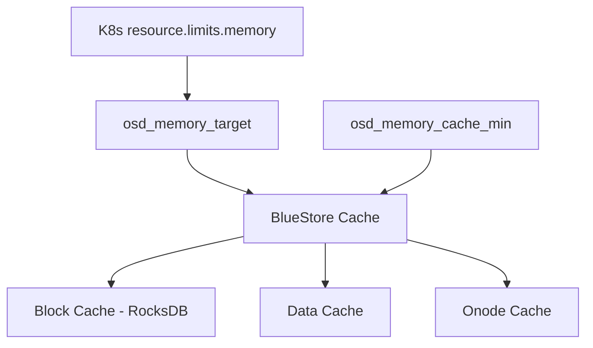

# How to Tune OSD Memory in Rook-Ceph

Author: [nawazdhandala](https://www.github.com/nawazdhandala)

Tags: Rook, Ceph, Kubernetes, OSD, Memory, Performance

Description: Learn how to tune OSD memory settings in Rook-Ceph including osd_memory_target, cache size, and Kubernetes resource limits for optimal performance.

---

Ceph OSDs use BlueStore, which dynamically manages its cache size based on available memory. Properly tuning OSD memory ensures your cluster achieves good cache hit rates without starving other workloads running on the same nodes.

## How BlueStore Memory Works



BlueStore automatically adjusts cache allocation based on `osd_memory_target`. The OSD will try to stay below this value. Setting this correctly is the single most impactful memory tuning action.

## Default Memory Settings

The default `osd_memory_target` is 4 GiB. For nodes with more RAM and high-throughput workloads, increasing this value significantly improves performance.

## Configure OSD Memory via CephCluster

```yaml
apiVersion: ceph.rook.io/v1
kind: CephCluster
metadata:
  name: rook-ceph
  namespace: rook-ceph
spec:
  dataDirHostPath: /var/lib/rook
  resources:
    osd:
      requests:
        cpu: "500m"
        memory: "4Gi"
      limits:
        cpu: "2"
        memory: "6Gi"
  storage:
    useAllNodes: true
    useAllDevices: false
    deviceFilter: "^sd[b-z]"
    config:
      # Set osd_memory_target to match k8s memory limit minus overhead
      osd_memory_target: "4294967296"    # 4 GiB in bytes
```

## Recommended Memory Target Formula

A good rule of thumb is:

```text
osd_memory_target = K8s memory limit - 1 GiB (OS/process overhead)
```

For a 6 GiB limit, set `osd_memory_target` to 5 GiB (5368709120 bytes).

## Per-Node Memory Configuration

```yaml
spec:
  storage:
    nodes:
      - name: high-mem-node
        config:
          osd_memory_target: "8589934592"   # 8 GiB
        resources:
          requests:
            memory: "8Gi"
          limits:
            memory: "10Gi"
      - name: low-mem-node
        config:
          osd_memory_target: "2147483648"   # 2 GiB
        resources:
          requests:
            memory: "2Gi"
          limits:
            memory: "3Gi"
```

## Configure Cache Minimum

Prevent BlueStore from shrinking its cache too aggressively under memory pressure:

```yaml
spec:
  storage:
    config:
      osd_memory_target: "4294967296"
      osd_memory_cache_min: "536870912"   # 512 MiB minimum cache
```

## Apply Configuration via Ceph Toolbox

To update memory settings on a running cluster without restarting OSDs:

```bash
# Open Ceph toolbox
kubectl exec -n rook-ceph deploy/rook-ceph-tools -- bash

# Set memory target for all OSDs
ceph config set osd osd_memory_target 4294967296

# Set minimum cache size
ceph config set osd osd_memory_cache_min 536870912

# Verify the settings
ceph config get osd osd_memory_target
ceph config get osd osd_memory_cache_min

# Check current cache usage
ceph daemon osd.0 perf dump | grep -A5 "bluefs"
```

## Monitor OSD Memory Usage

```bash
# Check current OSD memory consumption via Kubernetes
kubectl top pods -n rook-ceph -l app=rook-ceph-osd

# Detailed OSD stats from Ceph
kubectl exec -n rook-ceph deploy/rook-ceph-tools -- \
  ceph daemon osd.0 dump_mempools

# Check BlueStore cache statistics
kubectl exec -n rook-ceph deploy/rook-ceph-tools -- \
  ceph daemon osd.0 perf dump | python3 -m json.tool | grep -A10 bluestore_cache
```

## Memory Tuning for Different Workloads

| Workload | Recommended osd_memory_target |
|---|---|
| Small cluster (dev/test) | 2 GiB |
| General purpose production | 4 GiB |
| High-throughput sequential I/O | 6-8 GiB |
| Random I/O intensive (DB) | 8-16 GiB |
| NVMe all-flash | 8-16 GiB |

## Disable Automatic Memory Tuning

If you prefer static cache sizing, disable automatic tuning:

```bash
kubectl exec -n rook-ceph deploy/rook-ceph-tools -- \
  ceph config set osd bluestore_cache_autotune false

# Then set fixed cache size
kubectl exec -n rook-ceph deploy/rook-ceph-tools -- \
  ceph config set osd bluestore_cache_size_hdd 1073741824   # 1 GiB
```

## Summary

Tuning OSD memory in Rook-Ceph primarily involves setting `osd_memory_target` to a value slightly below the Kubernetes memory limit. BlueStore automatically allocates cache from this budget. For production clusters, set at least 4 GiB per OSD and monitor cache hit rates to determine whether increasing the limit further improves throughput.
