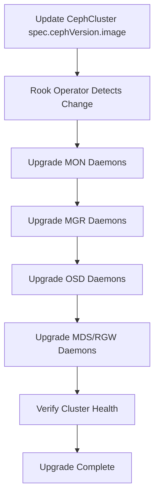

# How to Upgrade the Ceph Version in Rook

Author: [nawazdhandala](https://www.github.com/nawazdhandala)

Tags: Rook, Ceph, Kubernetes, Upgrade, Storage

Description: Learn how to safely upgrade the Ceph version managed by Rook, including image updates, rolling daemon restarts, and health verification steps.

---

## How Ceph Version Upgrades Work in Rook

When you upgrade the Ceph version in a Rook-managed cluster, the Rook operator performs a controlled rolling upgrade of all Ceph daemons. It upgrades components in this order: MONs, MGRs, OSDs, then MDSs and RGWs. At each step, it waits for the component to be healthy before proceeding.



## Prerequisites

Before upgrading the Ceph version:

- The Rook operator must support the target Ceph version. Check the [Rook compatibility matrix](https://rook.io/docs/rook/latest/Getting-Started/quickstart/).
- The Ceph cluster must be in `HEALTH_OK` state before starting.
- You must be upgrading sequentially - do not skip major Ceph versions.

Check the current Ceph version:

```bash
kubectl -n rook-ceph exec -it deploy/rook-ceph-tools -- ceph version
```

Check current cluster health:

```bash
kubectl -n rook-ceph exec -it deploy/rook-ceph-tools -- ceph status
```

## Finding the Right Ceph Image

Rook uses official Ceph container images. Find the correct image tag on [Quay.io](https://quay.io/repository/ceph/ceph?tab=tags).

Common Ceph image tags follow this pattern:

```text
quay.io/ceph/ceph:v18.2.4
quay.io/ceph/ceph:v19.2.0
```

Always use a specific version tag rather than `latest` to ensure reproducibility.

## Updating the CephCluster Spec

To trigger the upgrade, update the `cephVersion.image` field in your CephCluster resource.

Edit the CephCluster directly:

```bash
kubectl -n rook-ceph edit cephcluster rook-ceph
```

Or patch it with a specific image:

```bash
kubectl -n rook-ceph patch cephcluster rook-ceph --type merge \
  -p '{"spec":{"cephVersion":{"image":"quay.io/ceph/ceph:v19.2.0"}}}'
```

The full relevant section of the CephCluster spec looks like this:

```yaml
apiVersion: ceph.rook.io/v1
kind: CephCluster
metadata:
  name: rook-ceph
  namespace: rook-ceph
spec:
  cephVersion:
    image: quay.io/ceph/ceph:v19.2.0
    allowUnsupported: false
  dataDirHostPath: /var/lib/rook
```

The `allowUnsupported: false` field ensures Rook will refuse to use a Ceph version it does not officially support.

## Monitoring the Upgrade Progress

Watch the operator logs to follow the upgrade steps:

```bash
kubectl -n rook-ceph logs -f deployment/rook-ceph-operator
```

Monitor the pod restarts in the rook-ceph namespace:

```bash
watch kubectl -n rook-ceph get pods
```

Check the CephCluster status conditions:

```bash
kubectl -n rook-ceph get cephcluster rook-ceph -o jsonpath='{.status.conditions}' | python3 -m json.tool
```

The `phase` field shows the current state:

```bash
kubectl -n rook-ceph get cephcluster rook-ceph -o jsonpath='{.status.phase}'
```

## Verifying Each Stage

After MON upgrade, confirm all MONs are in quorum:

```bash
kubectl -n rook-ceph exec -it deploy/rook-ceph-tools -- ceph mon stat
```

After OSD upgrade, confirm all OSDs are up and in:

```bash
kubectl -n rook-ceph exec -it deploy/rook-ceph-tools -- ceph osd stat
kubectl -n rook-ceph exec -it deploy/rook-ceph-tools -- ceph osd tree
```

Check for any HEALTH_WARN or HEALTH_ERR conditions:

```bash
kubectl -n rook-ceph exec -it deploy/rook-ceph-tools -- ceph health detail
```

## Handling Upgrade Failures

If an OSD fails to upgrade, check the OSD pod logs:

```bash
kubectl -n rook-ceph logs -l app=rook-ceph-osd --tail=100
```

If the cluster gets stuck in `Updating` state, check the operator logs for the specific failure reason. A common issue is insufficient PGs or objects in a non-clean state blocking OSD upgrades.

Force the cluster health check to allow the upgrade to proceed on HEALTH_WARN (use with caution):

```bash
kubectl -n rook-ceph exec -it deploy/rook-ceph-tools -- ceph osd set noout
```

After resolving the issue, unset the flag:

```bash
kubectl -n rook-ceph exec -it deploy/rook-ceph-tools -- ceph osd unset noout
```

## Post-Upgrade Validation

After the upgrade completes, verify the new version across all daemons:

```bash
kubectl -n rook-ceph exec -it deploy/rook-ceph-tools -- ceph versions
```

Run a full cluster health check:

```bash
kubectl -n rook-ceph exec -it deploy/rook-ceph-tools -- ceph status
kubectl -n rook-ceph exec -it deploy/rook-ceph-tools -- ceph df
kubectl -n rook-ceph exec -it deploy/rook-ceph-tools -- ceph osd pool ls detail
```

## Summary

Upgrading the Ceph version in Rook is done by updating the `cephVersion.image` field in the CephCluster resource. Rook handles the rolling upgrade automatically, proceeding through MONs, MGRs, OSDs, and gateway daemons in sequence. Monitor the upgrade through operator logs and `ceph status`, and always ensure the cluster is healthy before and after the upgrade to avoid data unavailability.
