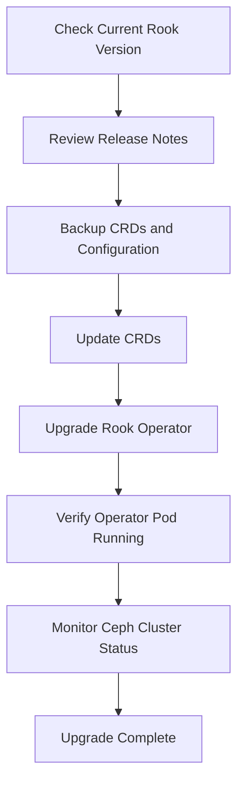

# How to Upgrade the Rook Operator on Kubernetes

Author: [nawazdhandala](https://www.github.com/nawazdhandala)

Tags: Rook, Ceph, Kubernetes, Operator, Upgrade, Storage

Description: Step-by-step guide to safely upgrading the Rook operator on Kubernetes, covering pre-checks, Helm-based and manifest-based upgrade paths.

---

## How Rook Operator Upgrades Work

The Rook operator manages the lifecycle of the Ceph cluster inside Kubernetes. When you upgrade the Rook operator, the running Ceph daemons are not immediately restarted - the operator itself is updated first, then it coordinates rolling updates to the Ceph cluster components. This separation lets you upgrade the management plane independently of the storage plane.

The upgrade process follows this sequence:



## Prerequisites

Before upgrading, ensure:

- The Ceph cluster is healthy (`ceph status` shows `HEALTH_OK` or `HEALTH_WARN` with non-critical warnings)
- You have `kubectl` configured with cluster admin access
- You have a backup of your CephCluster CRDs and any custom configurations
- You have reviewed the [Rook release notes](https://rook.io/docs/rook/latest/Contributing/development-flow/) for breaking changes between versions

Check the current Rook operator version:

```bash
kubectl -n rook-ceph get deployment rook-ceph-operator -o jsonpath='{.spec.template.spec.containers[0].image}'
```

Check the current Ceph cluster health:

```bash
kubectl -n rook-ceph exec -it deploy/rook-ceph-tools -- ceph status
```

## Upgrading with Helm

If you deployed Rook using Helm, upgrading is straightforward.

First, update your Helm repo:

```bash
helm repo update rook-release
```

Check the available chart versions:

```bash
helm search repo rook-release/rook-ceph --versions | head -10
```

Review the values diff before upgrading to understand what has changed:

```bash
helm diff upgrade rook-ceph rook-release/rook-ceph \
  --namespace rook-ceph \
  --version 1.16.0
```

Apply the upgrade:

```bash
helm upgrade rook-ceph rook-release/rook-ceph \
  --namespace rook-ceph \
  --version 1.16.0 \
  --reuse-values
```

Update the CephCluster chart separately if you also manage it via Helm:

```bash
helm upgrade rook-ceph-cluster rook-release/rook-ceph-cluster \
  --namespace rook-ceph \
  --version 1.16.0 \
  --reuse-values
```

## Upgrading with kubectl and Manifests

If you deployed Rook with raw manifests, follow these steps.

Download the new CRDs for the target version and apply them:

```bash
kubectl apply --server-side -f \
  https://raw.githubusercontent.com/rook/rook/v1.16.0/deploy/examples/crds.yaml
```

Apply the new common RBAC resources:

```bash
kubectl apply -f \
  https://raw.githubusercontent.com/rook/rook/v1.16.0/deploy/examples/common.yaml
```

Apply the updated operator deployment:

```bash
kubectl apply -f \
  https://raw.githubusercontent.com/rook/rook/v1.16.0/deploy/examples/operator.yaml
```

Watch the operator pod restart and come up with the new version:

```bash
kubectl -n rook-ceph rollout status deployment/rook-ceph-operator
```

## Verifying the Upgrade

After the operator upgrades, verify the new operator image is running:

```bash
kubectl -n rook-ceph get pod -l app=rook-ceph-operator -o jsonpath='{.items[0].spec.containers[0].image}'
```

Watch the Rook operator logs for any errors:

```bash
kubectl -n rook-ceph logs -f deployment/rook-ceph-operator
```

Confirm the Ceph cluster health has not degraded:

```bash
kubectl -n rook-ceph exec -it deploy/rook-ceph-tools -- ceph status
kubectl -n rook-ceph exec -it deploy/rook-ceph-tools -- ceph health detail
```

Check that all Rook-managed pods are running:

```bash
kubectl -n rook-ceph get pods
```

## Handling CRD Updates

Between major versions, Rook CRDs often gain new fields or change existing ones. Always apply CRDs before the operator upgrade. If you see errors about unknown fields, patch the CRDs using server-side apply:

```bash
kubectl apply --server-side --force-conflicts -f crds.yaml
```

Verify the CRDs have the correct version:

```bash
kubectl get crd cephclusters.ceph.rook.io -o jsonpath='{.metadata.annotations.controller-gen\.kubebuilder\.io/version}'
```

## Rollback Strategy

If something goes wrong, roll back the operator deployment to the previous image:

```bash
kubectl -n rook-ceph rollout undo deployment/rook-ceph-operator
```

Verify the rollback:

```bash
kubectl -n rook-ceph rollout status deployment/rook-ceph-operator
kubectl -n rook-ceph get pod -l app=rook-ceph-operator
```

Note: rolling back the operator does not roll back CRD changes. If you applied new CRDs, you may need to restore them from a backup.

## Summary

Upgrading the Rook operator involves updating CRDs first, then the operator deployment, either via Helm or raw manifests. The operator upgrade does not immediately restart Ceph daemons, giving you time to verify stability before Ceph component upgrades proceed. Always check cluster health before and after the upgrade, and keep a rollback plan ready by noting the previous operator image tag.
