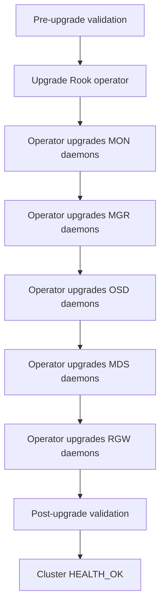

# How to Upgrade Rook-Ceph with Zero Downtime

Author: [nawazdhandala](https://www.github.com/nawazdhandala)

Tags: Rook, Ceph, Kubernetes, Upgrade, ZeroDowntime, Maintenance, Operator

Description: A production-safe guide to upgrading the Rook operator and Ceph daemons with zero downtime, including pre-flight checks, rollout sequencing, and validation steps.

---

Zero-downtime upgrades in Rook require upgrading the operator first, then allowing it to rolling-update Ceph daemons in the correct order. PVCs remain accessible throughout if the cluster is healthy before starting.

## Upgrade Order



## Pre-Upgrade Checklist

```bash
# 1. Confirm cluster is HEALTH_OK
kubectl exec -n rook-ceph deploy/rook-ceph-tools -- ceph status
kubectl exec -n rook-ceph deploy/rook-ceph-tools -- ceph health detail

# 2. Check all OSDs are up and in
kubectl exec -n rook-ceph deploy/rook-ceph-tools -- ceph osd stat
# "X osds: X up, X in" (no down or out)

# 3. Confirm no PGs degraded
kubectl exec -n rook-ceph deploy/rook-ceph-tools -- ceph pg stat
# active+clean for all PGs

# 4. Check current Rook version
kubectl get deployment rook-ceph-operator -n rook-ceph \
  -o jsonpath='{.spec.template.spec.containers[0].image}'

# 5. Check current Ceph version
kubectl exec -n rook-ceph deploy/rook-ceph-tools -- ceph version
```

## Disable PG Auto-Scrub During Upgrade (Optional)

```bash
kubectl exec -n rook-ceph deploy/rook-ceph-tools -- \
  ceph osd set noscrub

kubectl exec -n rook-ceph deploy/rook-ceph-tools -- \
  ceph osd set nodeep-scrub
```

## Upgrade the Rook Operator

### Using Helm

```bash
# Check current chart version
helm list -n rook-ceph

# Update repo
helm repo update rook-release

# Check available versions
helm search repo rook-release/rook-ceph --versions | head -10

# Upgrade operator (example: v1.13.x to v1.14.x)
helm upgrade rook-ceph rook-release/rook-ceph \
  --namespace rook-ceph \
  --version v1.14.0 \
  --reuse-values

# Monitor operator pod
kubectl rollout status deployment rook-ceph-operator -n rook-ceph
```

### Using kubectl (manifest)

```bash
# Download the new operator manifest
curl -O https://raw.githubusercontent.com/rook/rook/v1.14.0/deploy/examples/operator.yaml

# Review changes before applying
kubectl diff -f operator.yaml

# Apply the new operator
kubectl apply -f operator.yaml

# Watch operator rollout
kubectl rollout status deployment rook-ceph-operator -n rook-ceph
```

## Upgrade the Ceph Version

Update the Ceph image in the CephCluster spec:

```yaml
apiVersion: ceph.rook.io/v1
kind: CephCluster
metadata:
  name: rook-ceph
  namespace: rook-ceph
spec:
  cephVersion:
    image: quay.io/ceph/ceph:v18.2.4   # New Ceph Reef version
    allowUnsupported: false
```

```bash
kubectl apply -f cephcluster.yaml

# Watch daemon rolling update
kubectl get pods -n rook-ceph -w | grep -v Running
```

## Monitor the Rolling Upgrade

```bash
# Watch MONs update first
kubectl get pods -n rook-ceph -l app=rook-ceph-mon -w

# Then MGR
kubectl get pods -n rook-ceph -l app=rook-ceph-mgr -w

# Then OSDs (one at a time)
kubectl get pods -n rook-ceph -l app=rook-ceph-osd -w

# Cluster should remain HEALTH_OK or HEALTH_WARN during OSD rolling updates
watch kubectl exec -n rook-ceph deploy/rook-ceph-tools -- ceph status
```

## Verify Each Daemon After Upgrade

```bash
# Check MON versions
kubectl exec -n rook-ceph deploy/rook-ceph-tools -- ceph versions

# Should show:
# {
#   "mon": {"ceph version 18.2.4 ...": 3},
#   "mgr": {"ceph version 18.2.4 ...": 2},
#   "osd": {"ceph version 18.2.4 ...": 9},
#   "mds": {"ceph version 18.2.4 ...": 2}
# }

# Upgrade is complete when all daemons show the new version
```

## Post-Upgrade Validation

```bash
# Re-enable scrub
kubectl exec -n rook-ceph deploy/rook-ceph-tools -- \
  ceph osd unset noscrub
kubectl exec -n rook-ceph deploy/rook-ceph-tools -- \
  ceph osd unset nodeep-scrub

# Final health check
kubectl exec -n rook-ceph deploy/rook-ceph-tools -- ceph status
kubectl exec -n rook-ceph deploy/rook-ceph-tools -- ceph health detail

# Verify PVCs still accessible
kubectl get pvc --all-namespaces | grep Bound
```

## Summary

Zero-downtime Rook-Ceph upgrades require a healthy cluster as the starting point, followed by upgrading the Rook operator, then updating the Ceph version image in the CephCluster CR. The operator handles the rolling update of all daemons in the correct order (MON, MGR, OSD, MDS, RGW). Monitor `ceph status` throughout and disable scrub during the OSD rolling update to reduce overhead. Always validate cluster health before and after each stage.
