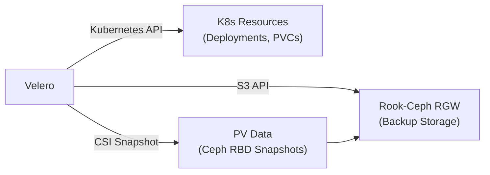

# How to Use Rook-Ceph with Velero for Kubernetes Backup

Author: [nawazdhandala](https://www.github.com/nawazdhandala)

Tags: Rook, Ceph, Kubernetes, Velero, Backup, Storage, Disaster Recovery

Description: Configure Velero to back up Kubernetes workloads and Rook-Ceph persistent volumes using CSI snapshots and S3-compatible object storage for disaster recovery.

---

## How Velero Works with Rook-Ceph

Velero backs up Kubernetes resources (namespaces, deployments, PVCs) and persistent volume data. When used with Rook-Ceph, Velero can use two mechanisms for PV backup: CSI volume snapshots (using the Rook-Ceph CSI snapshotter) and Restic/Kopia file-level backup (pod filesystem backup). Velero also stores backup metadata in an S3-compatible object store, which can be Rook-Ceph's RGW.



## Prerequisites

- Rook-Ceph cluster with RGW object store deployed
- CSI snapshotter components installed (`volumesnapshotclasses.snapshot.storage.k8s.io` CRD)
- Velero CLI installed

## Step 1 - Set Up Rook-Ceph as Velero's Object Storage

Create a dedicated bucket for Velero backups:

```bash
kubectl -n rook-ceph exec -it deploy/rook-ceph-tools -- \
  radosgw-admin user create \
  --uid=velero \
  --display-name="Velero Backup User" \
  --access-key=velero-access-key \
  --secret-key=velero-secret-key

kubectl -n rook-ceph exec -it deploy/rook-ceph-tools -- \
  radosgw-admin bucket create \
  --bucket=velero-backups \
  --uid=velero
```

Get the RGW endpoint:

```bash
RGW_IP=$(kubectl -n rook-ceph get svc rook-ceph-rgw-my-store -o jsonpath='{.spec.clusterIP}')
echo "RGW endpoint: http://${RGW_IP}:80"
```

Create the Velero credentials file:

```bash
cat > velero-credentials.ini << 'EOF'
[default]
aws_access_key_id=velero-access-key
aws_secret_access_key=velero-secret-key
EOF
```

## Step 2 - Install Velero with Rook-Ceph RGW Backend

Install Velero using the AWS plugin (compatible with S3-API RGW):

```bash
velero install \
  --provider aws \
  --plugins velero/velero-plugin-for-aws:v1.10.0 \
  --bucket velero-backups \
  --secret-file ./velero-credentials.ini \
  --backup-location-config \
    region=us-east-1,s3ForcePathStyle=true,s3Url=http://<rgw-ip>:80 \
  --use-volume-snapshots=true \
  --features=EnableCSI \
  --namespace velero
```

The `s3ForcePathStyle=true` is required for RGW compatibility.

Verify Velero is running:

```bash
kubectl -n velero get pods
velero backup-location get
```

## Step 3 - Configure VolumeSnapshotClass for CSI Snapshots

Create a VolumeSnapshotClass that Velero will use for RBD volume snapshots:

```yaml
apiVersion: snapshot.storage.k8s.io/v1
kind: VolumeSnapshotClass
metadata:
  name: csi-rbdplugin-snapclass
  labels:
    velero.io/csi-volumesnapshot-class: "true"
driver: rook-ceph.rbd.csi.ceph.com
deletionPolicy: Retain
parameters:
  clusterID: rook-ceph
  csi.storage.k8s.io/volumesnapshot/secret-name: rook-csi-rbd-provisioner
  csi.storage.k8s.io/volumesnapshot/secret-namespace: rook-ceph
```

The `velero.io/csi-volumesnapshot-class: "true"` label tells Velero to use this snapshot class for RBD volumes.

Apply it:

```bash
kubectl apply -f volumesnapshotclass.yaml
```

For CephFS:

```yaml
apiVersion: snapshot.storage.k8s.io/v1
kind: VolumeSnapshotClass
metadata:
  name: csi-cephfsplugin-snapclass
  labels:
    velero.io/csi-volumesnapshot-class: "true"
driver: rook-ceph.cephfs.csi.ceph.com
deletionPolicy: Retain
parameters:
  clusterID: rook-ceph
  csi.storage.k8s.io/volumesnapshot/secret-name: rook-csi-cephfs-provisioner
  csi.storage.k8s.io/volumesnapshot/secret-namespace: rook-ceph
```

## Step 4 - Create a Backup

Back up a specific namespace including PVCs:

```bash
velero backup create my-app-backup \
  --include-namespaces my-app \
  --snapshot-volumes=true \
  --volume-snapshot-locations default
```

Check backup status:

```bash
velero backup describe my-app-backup --details
velero backup logs my-app-backup
```

Schedule automated backups:

```bash
velero schedule create daily-backup \
  --schedule="0 2 * * *" \
  --include-namespaces my-app \
  --ttl 720h
```

## Step 5 - Restore from Backup

List available backups:

```bash
velero backup get
```

Restore to a new namespace:

```bash
velero restore create my-app-restore \
  --from-backup my-app-backup \
  --namespace-mappings my-app:my-app-restored
```

Monitor the restore progress:

```bash
velero restore describe my-app-restore
velero restore logs my-app-restore
```

Verify the restored PVCs:

```bash
kubectl -n my-app-restored get pvc
kubectl -n my-app-restored get pods
```

## Step 6 - Using Restic/Kopia for File-Level Backup

For volumes that don't support CSI snapshots (or as a complement), enable Restic/Kopia backup by adding the annotation to pods:

```yaml
apiVersion: apps/v1
kind: Deployment
metadata:
  name: my-app
spec:
  template:
    metadata:
      annotations:
        backup.velero.io/backup-volumes: data-volume
    spec:
      containers:
        - name: app
          image: myapp:latest
          volumeMounts:
            - name: data-volume
              mountPath: /data
      volumes:
        - name: data-volume
          persistentVolumeClaim:
            claimName: my-app-data
```

## Summary

Velero integrates with Rook-Ceph using two features: the RGW object store as an S3-compatible backup location for Velero metadata and snapshot data, and CSI volume snapshots for point-in-time backup of PVC data. Configure the backup location with `s3ForcePathStyle=true` for RGW compatibility, create VolumeSnapshotClasses labeled for Velero, and enable `--features=EnableCSI` during Velero installation. Schedule regular backups and periodically test restores to validate recovery capability.
