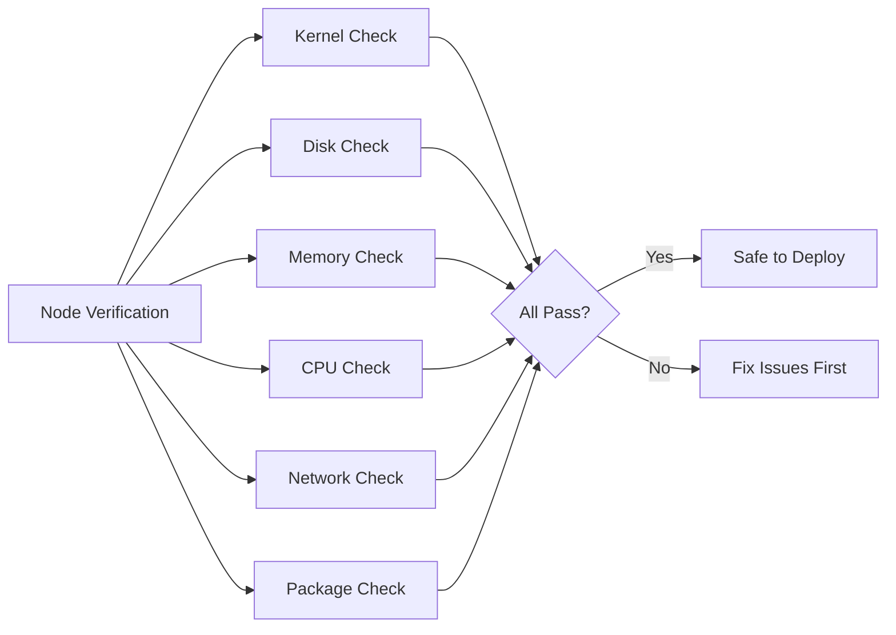

# How to Verify Kubernetes Node Requirements for Rook-Ceph Deployment

Author: [nawazdhandala](https://www.github.com/nawazdhandala)

Tags: Rook, Ceph, Kubernetes, Node, Verification, Storage

Description: Learn how to systematically verify that Kubernetes nodes meet all hardware, kernel, and software requirements before deploying Rook-Ceph storage.

---

## Why Node Verification Is Critical

Rook-Ceph operates differently from typical Kubernetes applications. OSDs communicate directly with block devices, CSI drivers mount filesystems using kernel modules, and monitors require stable hostnames and persistent storage. A node that appears healthy to Kubernetes may still cause Rook-Ceph failures if it lacks the right kernel version, modules, or disk configuration.



## Minimum Hardware Requirements

Check that each storage node meets the minimum resource thresholds before deploying Rook-Ceph:

| Component | Minimum | Recommended |
|-----------|---------|-------------|
| CPU (per OSD) | 1 core | 2 cores |
| RAM (per OSD) | 2 GB | 4 GB |
| RAM (per Mon) | 1 GB | 2 GB |
| RAM (per Mgr) | 512 MB | 1 GB |
| Disk (OSD) | 10 GB raw | 100+ GB raw |
| Network | 1 Gbps | 10 Gbps |

Check available memory on a node:

```bash
kubectl get node node1 -o jsonpath='{.status.capacity.memory}'
```

List allocatable CPU and memory across all nodes:

```bash
kubectl get nodes -o custom-columns=\
NAME:.metadata.name,\
CPU:.status.allocatable.cpu,\
MEMORY:.status.allocatable.memory
```

## Kernel Version Verification

Ceph kernel support improves with newer kernels. Check the kernel version on each node:

```bash
kubectl get nodes -o custom-columns=\
NAME:.metadata.name,\
KERNEL:.status.nodeInfo.kernelVersion
```

You can also run this directly on a node:

```bash
uname -r
```

Rook-Ceph recommends kernel 4.17 or later. For CephFS with quotas, kernel 4.17+ is required. For RBD fast-diff, kernel 4.10+ is needed.

## Kernel Module Verification

Check that the required kernel modules are loadable on each node. The easiest way is to run a DaemonSet that probes the modules:

```yaml
apiVersion: apps/v1
kind: DaemonSet
metadata:
  name: rook-prereq-check
  namespace: default
spec:
  selector:
    matchLabels:
      app: rook-prereq-check
  template:
    metadata:
      labels:
        app: rook-prereq-check
    spec:
      hostPID: true
      containers:
        - name: checker
          image: busybox
          command:
            - /bin/sh
            - -c
            - |
              echo "Node: $(hostname)"
              lsmod | grep rbd && echo "rbd: OK" || echo "rbd: MISSING"
              lsmod | grep ceph && echo "ceph: OK" || echo "ceph: MISSING"
              sleep 3600
          securityContext:
            privileged: true
      tolerations:
        - operator: Exists
```

Apply and read the logs:

```bash
kubectl apply -f prereq-check.yaml
kubectl logs -l app=rook-prereq-check --prefix=true
```

## Block Device Availability Check

Verify that each node has clean block devices available for Rook-Ceph. Run this command on each storage node:

```bash
lsblk --output NAME,SIZE,TYPE,FSTYPE,MOUNTPOINT,LABEL
```

Identify devices that are unpartitioned, have no filesystem, and are not mounted - these are eligible:

```text
NAME    SIZE TYPE FSTYPE MOUNTPOINT LABEL
sda     100G disk
sdb     100G disk
nvme0n1 500G disk
```

Confirm no LVM signatures remain on the target devices:

```bash
sudo pvdisplay /dev/sdc 2>&1 | grep -c "No physical volume" && echo "Clean" || echo "Has LVM"
```

## Hostname Resolution Check

Ceph monitors use hostnames for quorum. Each node's hostname must be resolvable from all other nodes:

```bash
# On each node, verify self-resolution
hostname -f
nslookup $(hostname -f)

# Test cross-node resolution
nslookup node2.example.com
```

If DNS is not available, add entries to `/etc/hosts` on all nodes:

```bash
echo "192.168.1.11 node1.example.com node1" | sudo tee -a /etc/hosts
echo "192.168.1.12 node2.example.com node2" | sudo tee -a /etc/hosts
echo "192.168.1.13 node3.example.com node3" | sudo tee -a /etc/hosts
```

## CSI Driver Node Requirements

The Rook CSI driver (ceph-csi) runs on every node that needs to mount Ceph volumes. Check that the CSI requirements are met:

```bash
# Check if iscsiadm is available (needed for some configurations)
which iscsiadm

# Check if cryptsetup is available (needed for encrypted volumes)
which cryptsetup

# Check if multipath is properly configured
cat /etc/multipath.conf 2>/dev/null || echo "No multipath config found"
```

## Pod Security Verification

Verify the namespace allows privileged pods, which Rook-Ceph requires:

```bash
kubectl get namespace rook-ceph -o yaml | grep pod-security
```

If Pod Security Admission is enforced, check the labels:

```bash
kubectl get namespace rook-ceph --show-labels
```

The namespace should have `pod-security.kubernetes.io/enforce=privileged`.

## Consolidated Verification Script

Use this script to check all requirements from your local machine using `kubectl`:

```bash
#!/bin/bash
echo "=== Rook-Ceph Node Requirements Check ==="

echo ""
echo "--- Kubernetes Version ---"
kubectl version --short 2>/dev/null | head -2

echo ""
echo "--- Node Status ---"
kubectl get nodes -o wide

echo ""
echo "--- Node Resources ---"
kubectl get nodes -o custom-columns=\
NAME:.metadata.name,\
STATUS:.status.conditions[-1].type,\
CPU:.status.allocatable.cpu,\
MEMORY:.status.allocatable.memory,\
KERNEL:.status.nodeInfo.kernelVersion

echo ""
echo "--- Storage Capacity Check ---"
kubectl get nodes -o jsonpath='{range .items[*]}{.metadata.name}{"\t"}{.status.capacity.ephemeral-storage}{"\n"}{end}'

echo "=== Check complete ==="
```

## Summary

Verifying node requirements before deploying Rook-Ceph prevents the most common class of deployment failures. The key checks are: sufficient CPU and RAM per daemon type, kernel version 4.17 or later with `rbd` and `ceph` modules loadable, clean block devices with no filesystem signatures or LVM metadata, reliable hostname resolution between nodes, and a namespace configured to allow privileged pods. Running a pre-deployment DaemonSet to automate these checks across all nodes catches problems before they surface as cryptic Ceph health warnings.
