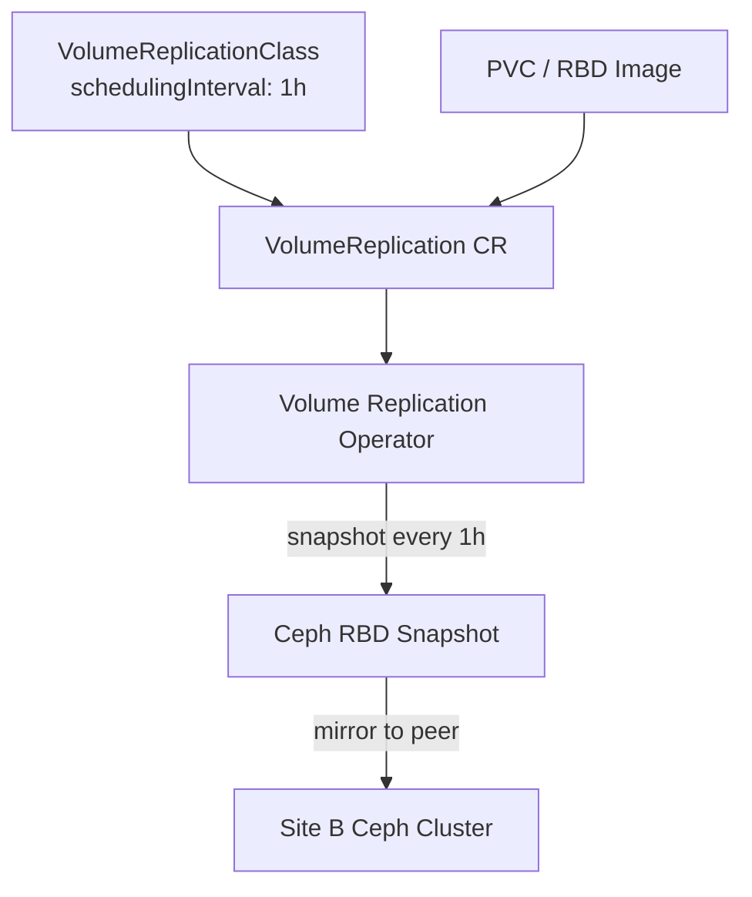

# How to Configure VolumeReplicationClass Scheduling Intervals in Rook

Author: [nawazdhandala](https://www.github.com/nawazdhandala)

Tags: Rook, Ceph, Kubernetes, Storage

Description: Define VolumeReplicationClass resources with custom scheduling intervals to control how frequently RBD snapshots are replicated to a peer Ceph cluster.

---

## Introduction

The `VolumeReplicationClass` is a cluster-scoped Kubernetes custom resource provided by the Volume Replication Operator (VRO). It defines the replication driver and scheduling parameters used by `VolumeReplication` objects. For Rook-based RBD mirroring, the scheduling interval in the VolumeReplicationClass controls how often snapshot-based replication syncs data to the peer cluster, directly affecting your Recovery Point Objective (RPO).

## VolumeReplicationClass Architecture



## Prerequisites

- Volume Replication Operator installed in the Kubernetes cluster
- Rook CephBlockPool with mirroring enabled in snapshot mode
- CSI addons deployed (required by VRO for snapshot scheduling)

## Step 1: Install the Volume Replication Operator

```bash
# Install via operator hub or directly
kubectl apply -f https://raw.githubusercontent.com/csi-addons/volume-replication-operator/main/config/crd/bases/replication.storage.openshift.io_volumereplicationclasses.yaml
kubectl apply -f https://raw.githubusercontent.com/csi-addons/volume-replication-operator/main/config/crd/bases/replication.storage.openshift.io_volumereplications.yaml

# Install the operator itself
kubectl apply -f https://raw.githubusercontent.com/csi-addons/volume-replication-operator/main/config/manager/manager.yaml

# Verify the operator is running
kubectl get pods -n volume-replication-system
```

## Step 2: Create a VolumeReplicationClass with a Specific Interval

The `schedulingInterval` sets the replication frequency using a duration format (minutes, hours):

```yaml
# vrc-hourly.yaml
apiVersion: replication.storage.openshift.io/v1alpha1
kind: VolumeReplicationClass
metadata:
  name: rook-volumereplicationclass-1h
spec:
  provisioner: rook-ceph.rbd.csi.ceph.com
  parameters:
    # Scheduling interval for snapshot-based mirroring
    schedulingInterval: "1h"
    # Optional: offset within the interval to stagger snapshots
    schedulingStartTime: "00:00:00"
    # Mirroring mode: snapshot or journal
    mirroringMode: snapshot
    # Replication secret reference
    replication.storage.openshift.io/replication-secret-name: rook-csi-rbd-provisioner
    replication.storage.openshift.io/replication-secret-namespace: rook-ceph
```

```bash
kubectl apply -f vrc-hourly.yaml
```

## Step 3: Create VolumeReplicationClasses for Different RPO Tiers

Define multiple classes for different service tiers:

```yaml
# vrc-tiers.yaml

# Tier 1: Critical workloads - replicate every 15 minutes
apiVersion: replication.storage.openshift.io/v1alpha1
kind: VolumeReplicationClass
metadata:
  name: rook-vrc-15min
spec:
  provisioner: rook-ceph.rbd.csi.ceph.com
  parameters:
    schedulingInterval: "15m"
    mirroringMode: snapshot
    replication.storage.openshift.io/replication-secret-name: rook-csi-rbd-provisioner
    replication.storage.openshift.io/replication-secret-namespace: rook-ceph
---
# Tier 2: Important workloads - replicate every hour
apiVersion: replication.storage.openshift.io/v1alpha1
kind: VolumeReplicationClass
metadata:
  name: rook-vrc-1hour
spec:
  provisioner: rook-ceph.rbd.csi.ceph.com
  parameters:
    schedulingInterval: "1h"
    mirroringMode: snapshot
    replication.storage.openshift.io/replication-secret-name: rook-csi-rbd-provisioner
    replication.storage.openshift.io/replication-secret-namespace: rook-ceph
---
# Tier 3: Standard workloads - replicate every 24 hours
apiVersion: replication.storage.openshift.io/v1alpha1
kind: VolumeReplicationClass
metadata:
  name: rook-vrc-daily
spec:
  provisioner: rook-ceph.rbd.csi.ceph.com
  parameters:
    schedulingInterval: "24h"
    schedulingStartTime: "02:00:00"
    mirroringMode: snapshot
    replication.storage.openshift.io/replication-secret-name: rook-csi-rbd-provisioner
    replication.storage.openshift.io/replication-secret-namespace: rook-ceph
```

```bash
kubectl apply -f vrc-tiers.yaml
kubectl get volumereplicationclass
```

## Step 4: Enable Snapshot Scheduling on the CephBlockPool

The CephBlockPool must have snapshot scheduling enabled to match the VRC interval:

```yaml
# pool-snapshot-mirror.yaml
apiVersion: ceph.rook.io/v1
kind: CephBlockPool
metadata:
  name: replicapool
  namespace: rook-ceph
spec:
  replicated:
    size: 3
  mirroring:
    enabled: true
    mode: snapshot
    snapshotSchedules:
      # Match the most frequent VRC interval
      - interval: 15m
      - interval: 1h
      - interval: 24h
        startTime: "02:00:00"
```

```bash
kubectl apply -f pool-snapshot-mirror.yaml
```

## Step 5: Create a VolumeReplication Using the Class

```yaml
# volume-replication-app.yaml
apiVersion: replication.storage.openshift.io/v1alpha1
kind: VolumeReplication
metadata:
  name: db-volume-replication
  namespace: production
spec:
  # Reference the VolumeReplicationClass
  volumeReplicationClass: rook-vrc-15min
  # Source volume to replicate
  dataSource:
    apiGroup: ""
    kind: PersistentVolumeClaim
    name: database-pvc
  # Initial replication state (primary site)
  replicationState: primary
```

```bash
kubectl apply -f volume-replication-app.yaml

# Check replication status
kubectl describe volumereplication db-volume-replication -n production
```

## Step 6: Verify Snapshot Schedule on Ceph

```bash
kubectl -n rook-ceph exec -it deploy/rook-ceph-tools -- bash

# Check snapshot schedules for the mirrored image
rbd mirror image snapshot schedule list \
  replicapool/csi-vol-<image-id> \
  --format json

# Check scheduled snapshot status
rbd mirror image status replicapool/csi-vol-<image-id>

# List recent snapshots
rbd snap list replicapool/csi-vol-<image-id> | grep mirror
```

## Step 7: Monitor Replication Lag

The time between snapshot creation and completion on the peer indicates actual RPO:

```bash
# Check last sync time and lag
kubectl get volumereplication db-volume-replication -n production \
  -o jsonpath='{.status.lastSyncTime}'

# Check replication state details
kubectl describe volumereplication db-volume-replication -n production | grep -A10 "Status:"

# Check via Prometheus
# Metric: rbd_mirror_image_replaying_lag_seconds
# Alert if lag > scheduled interval
```

## Troubleshooting

```bash
# VolumeReplication stuck in unknown state
kubectl describe volumereplication db-volume-replication -n production

# Check VRO operator logs
kubectl logs -n volume-replication-system deploy/volume-replication-operator | tail -30

# Verify CSI addon supports scheduling
kubectl get csiaddon -A

# Check if snapshot schedule was created on the image
kubectl -n rook-ceph exec -it deploy/rook-ceph-tools -- \
  rbd mirror image snapshot schedule ls replicapool
```

## Summary

VolumeReplicationClass resources define the replication driver and scheduling interval for snapshot-based RBD mirroring. Multiple classes with different `schedulingInterval` values enable tiered RPO objectives (15 minutes for critical workloads, hourly for important, daily for standard). The interval in the VolumeReplicationClass must align with the `snapshotSchedules` configured on the CephBlockPool. VolumeReplication objects then reference the appropriate class to schedule replication for specific PVCs.
