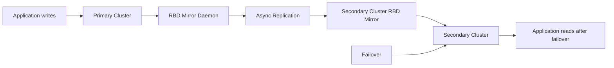

# How to Set Up Volume Replication with Rook-Ceph

Author: [nawazdhandala](https://www.github.com/nawazdhandala)

Tags: Rook, Ceph, Kubernetes, Replication, DisasterRecovery, RBD

Description: Learn how to configure cross-cluster RBD volume replication with Rook-Ceph using CephRBDMirror and VolumeReplication resources for disaster recovery.

---

## How RBD Mirroring Works

Rook-Ceph supports asynchronous RBD mirroring, which replicates RBD images from a primary cluster to a secondary cluster. This enables disaster recovery: if the primary cluster fails, applications can be failed over to the secondary cluster with minimal data loss. Mirroring works at the pool level (pool mirroring mode) or image level (image mirroring mode).



## Prerequisites

- Two separate Rook-Ceph clusters (primary and secondary)
- Network connectivity between the two clusters on Ceph OSD ports
- The `rook-ceph-operator` in both clusters must be version 1.8 or later

## Step 1 - Enable RBD Mirroring Pool Mode on Primary

First, configure the pool on the primary cluster to support mirroring:

```bash
# On the primary cluster
kubectl -n rook-ceph exec deploy/rook-ceph-tools -- bash -c "
  # Enable mirroring on the pool
  ceph osd pool application enable replicapool rbd
  rbd mirror pool enable replicapool pool

  # Get the bootstrap peer token for the secondary cluster
  rbd mirror pool peer bootstrap create \
    --site-name primary replicapool
"
```

Save the bootstrap token output - you will need it for the secondary cluster.

## Step 2 - Deploy CephRBDMirror on Both Clusters

Create a CephRBDMirror resource on the primary cluster:

```yaml
apiVersion: ceph.rook.io/v1
kind: CephRBDMirror
metadata:
  name: my-rbd-mirror
  namespace: rook-ceph
spec:
  # Number of mirror daemon instances
  count: 1
  peers:
    secretNames:
      # Secret containing the peer cluster bootstrap token
      - rbd-primary-site-secret
```

Create the same on the secondary cluster (with the secondary site secret).

## Step 3 - Create the Peer Bootstrap Secret

On the secondary cluster, create a secret with the bootstrap token from step 1:

```bash
# Create the secret on the secondary cluster
kubectl -n rook-ceph create secret generic rbd-primary-site-secret \
  --from-literal=token='<bootstrap-token-from-step-1>' \
  --from-literal=pool=replicapool
```

Create the corresponding secret on the primary cluster with the secondary bootstrap token.

## Step 4 - Configure Pool Mirroring

Update the CephBlockPool on both clusters to enable mirroring:

```yaml
# Primary cluster CephBlockPool
apiVersion: ceph.rook.io/v1
kind: CephBlockPool
metadata:
  name: replicapool
  namespace: rook-ceph
spec:
  failureDomain: host
  replicated:
    size: 3
  mirroring:
    enabled: true
    mode: image
    # Schedule snapshot-based mirroring
    snapshotSchedules:
      - interval: 24h
        startTime: "14:00:00-05:00"
```

## Step 5 - Enable Replication on Specific PVCs

Use the VolumeReplication CR (from the Kubernetes Volume Replication Operator) to mark specific PVCs for replication:

```bash
# Install the Volume Replication Operator
kubectl apply -f https://raw.githubusercontent.com/csi-addons/kubernetes-csi-addons/main/deploy/controller/crds.yaml
kubectl apply -f https://raw.githubusercontent.com/csi-addons/kubernetes-csi-addons/main/deploy/controller/rbac.yaml
kubectl apply -f https://raw.githubusercontent.com/csi-addons/kubernetes-csi-addons/main/deploy/controller/setup-controller.yaml
```

Create a VolumeReplicationClass:

```yaml
apiVersion: replication.storage.openshift.io/v1alpha1
kind: VolumeReplicationClass
metadata:
  name: rook-ceph-rbd-replicationclass
spec:
  provisioner: rook-ceph.rbd.csi.ceph.com
  parameters:
    mirroringMode: snapshot
    schedulingInterval: "1h"
    replication.storage.openshift.io/replication-secret-name: rook-csi-rbd-provisioner
    replication.storage.openshift.io/replication-secret-namespace: rook-ceph
```

Create a VolumeReplication to enable replication on a PVC:

```yaml
apiVersion: replication.storage.openshift.io/v1alpha1
kind: VolumeReplication
metadata:
  name: pvc-replication
  namespace: default
spec:
  volumeReplicationClass: rook-ceph-rbd-replicationclass
  replicationState: primary
  dataSource:
    kind: PersistentVolumeClaim
    name: my-critical-data
```

## Step 6 - Monitor Mirroring Status

Check the mirroring status from the primary cluster toolbox:

```bash
kubectl -n rook-ceph exec deploy/rook-ceph-tools -- \
  rbd mirror pool status replicapool
```

```text
health: OK
images: 3 total
    3 replaying
```

Check individual image mirroring status:

```bash
kubectl -n rook-ceph exec deploy/rook-ceph-tools -- \
  rbd mirror image status replicapool/csi-vol-xxxx
```

```text
csi-vol-xxxx:
  global_id:   xxxx-xxxx
  state:       up+replaying
  description: replaying, master_position=[object_number=45, tag_tid=2, entry_tid=4], mirror_position=[object_number=45, tag_tid=2, entry_tid=4], entries_behind_master=0
  last_update:  2026-03-31 10:00:00
```

`entries_behind_master=0` means the secondary is fully in sync.

## Step 7 - Failover to Secondary

During a disaster, promote the secondary cluster to primary:

```bash
# On the secondary cluster - demote primary (if accessible) and promote secondary
kubectl -n rook-ceph exec deploy/rook-ceph-tools -- bash -c "
  # Force promote the image on secondary
  rbd mirror image promote --force replicapool/csi-vol-xxxx
"
```

Update the VolumeReplication on the secondary cluster:

```yaml
spec:
  replicationState: secondary
```

## Summary

Rook-Ceph RBD mirroring enables disaster recovery by asynchronously replicating RBD images to a secondary cluster. Set up CephRBDMirror daemons on both clusters, exchange bootstrap peer secrets, enable `mirroring.mode: image` on the CephBlockPool, and use VolumeReplication CRs to control replication state per PVC. Monitor mirror lag with `rbd mirror pool status` and `rbd mirror image status`. During failover, force-promote images on the secondary cluster and redirect applications to the secondary cluster's endpoint.
