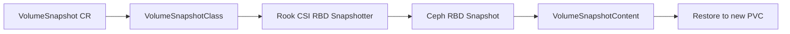

# How to Configure Volume Snapshot Class for RBD in Rook

Author: [nawazdhandala](https://www.github.com/nawazdhandala)

Tags: Rook, Ceph, Kubernetes, RBD, Snapshot, VolumeSnapshotClass

Description: Configure a VolumeSnapshotClass for Rook-Ceph RBD volumes to enable Kubernetes-native point-in-time snapshots and PVC cloning.

---

`VolumeSnapshotClass` defines the parameters used when creating volume snapshots via the Kubernetes snapshot API. For Rook-Ceph RBD volumes, the snapshot class tells the CSI driver which Ceph cluster to use and which credentials to authenticate with.

## Snapshot Architecture



## Prerequisites

- Kubernetes 1.20+ with snapshot CRDs installed
- Rook CSI snapshotter sidecar running
- `VolumeSnapshot` CRDs installed

## Install Snapshot CRDs

```bash
# Install snapshot CRDs (if not already present)
kubectl apply -f https://raw.githubusercontent.com/kubernetes-csi/external-snapshotter/v6.3.0/client/config/crd/snapshot.storage.k8s.io_volumesnapshotclasses.yaml
kubectl apply -f https://raw.githubusercontent.com/kubernetes-csi/external-snapshotter/v6.3.0/client/config/crd/snapshot.storage.k8s.io_volumesnapshotcontents.yaml
kubectl apply -f https://raw.githubusercontent.com/kubernetes-csi/external-snapshotter/v6.3.0/client/config/crd/snapshot.storage.k8s.io_volumesnapshots.yaml

# Install snapshot controller
kubectl apply -f https://raw.githubusercontent.com/kubernetes-csi/external-snapshotter/v6.3.0/deploy/kubernetes/snapshot-controller/rbac-snapshot-controller.yaml
kubectl apply -f https://raw.githubusercontent.com/kubernetes-csi/external-snapshotter/v6.3.0/deploy/kubernetes/snapshot-controller/setup-snapshot-controller.yaml
```

## Create the VolumeSnapshotClass for RBD

```yaml
apiVersion: snapshot.storage.k8s.io/v1
kind: VolumeSnapshotClass
metadata:
  name: csi-rbdplugin-snapclass
  annotations:
    snapshot.storage.kubernetes.io/is-default-class: "true"
driver: rook-ceph.rbd.csi.ceph.com
deletionPolicy: Delete    # or Retain
parameters:
  clusterID: rook-ceph
  csi.storage.k8s.io/snapshotter-secret-name: rook-csi-rbd-provisioner
  csi.storage.k8s.io/snapshotter-secret-namespace: rook-ceph
```

Apply it:

```bash
kubectl apply -f volumesnapshotclass-rbd.yaml
kubectl get volumesnapshotclass
```

## VolumeSnapshotClass with Retain Policy

Use `Retain` to keep the snapshot data even after deleting the `VolumeSnapshot` object:

```yaml
apiVersion: snapshot.storage.k8s.io/v1
kind: VolumeSnapshotClass
metadata:
  name: csi-rbdplugin-snapclass-retain
driver: rook-ceph.rbd.csi.ceph.com
deletionPolicy: Retain
parameters:
  clusterID: rook-ceph
  csi.storage.k8s.io/snapshotter-secret-name: rook-csi-rbd-provisioner
  csi.storage.k8s.io/snapshotter-secret-namespace: rook-ceph
```

## Create a VolumeSnapshot

```yaml
apiVersion: snapshot.storage.k8s.io/v1
kind: VolumeSnapshot
metadata:
  name: rbd-pvc-snapshot
  namespace: default
spec:
  volumeSnapshotClassName: csi-rbdplugin-snapclass
  source:
    persistentVolumeClaimName: my-rbd-pvc
```

```bash
kubectl apply -f snapshot.yaml
kubectl get volumesnapshot
kubectl describe volumesnapshot rbd-pvc-snapshot
```

## Restore a PVC from Snapshot

```yaml
apiVersion: v1
kind: PersistentVolumeClaim
metadata:
  name: restore-from-snapshot
  namespace: default
spec:
  accessModes:
    - ReadWriteOnce
  resources:
    requests:
      storage: 10Gi
  storageClassName: ceph-rbd
  dataSource:
    name: rbd-pvc-snapshot
    kind: VolumeSnapshot
    apiGroup: snapshot.storage.k8s.io
```

## Clone a PVC Directly (Without Snapshot)

```yaml
apiVersion: v1
kind: PersistentVolumeClaim
metadata:
  name: cloned-pvc
  namespace: default
spec:
  accessModes:
    - ReadWriteOnce
  resources:
    requests:
      storage: 10Gi
  storageClassName: ceph-rbd
  dataSource:
    name: my-rbd-pvc       # source PVC
    kind: PersistentVolumeClaim
```

## Check Snapshot Status in Ceph

```bash
kubectl exec -n rook-ceph deploy/rook-ceph-tools -- bash

# List snapshots in the pool
rbd snap ls replicapool/csi-vol-xxxxxxxx

# Show snapshot size
rbd snap info replicapool/csi-vol-xxxxxxxx@csi-snap-yyyyyyy
```

## Troubleshooting

```bash
# Check if CSI provisioner has snapshotter sidecar
kubectl get pods -n rook-ceph -l app=csi-rbdplugin-provisioner -o jsonpath=\
'{range .items[*]}{.metadata.name}{"\n"}{range .spec.containers[*]}{.name}{"\n"}{end}{end}'

# Check snapshot controller logs
kubectl logs -n kube-system deploy/snapshot-controller

# Check VolumeSnapshotContent
kubectl get volumesnapshotcontent
kubectl describe volumesnapshotcontent <name>
```

## Summary

A `VolumeSnapshotClass` for Rook-Ceph RBD configures the CSI snapshotter with the cluster ID and credentials needed to create RBD snapshots. Set `deletionPolicy: Delete` for ephemeral snapshots and `Retain` for long-lived backups. Once the class is in place, `VolumeSnapshot` objects trigger point-in-time snapshots, and `dataSource` references in PVC definitions enable restores or clones.
