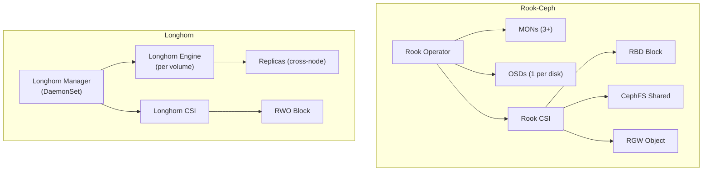

# How to Use Rook-Ceph with Longhorn for Comparison

Author: [nawazdhandala](https://www.github.com/nawazdhandala)

Tags: Rook, Ceph, Longhorn, Kubernetes, Storage, Comparison

Description: Compare Rook-Ceph and Longhorn storage solutions for Kubernetes, covering architecture, performance, operational complexity, and migration paths between the two.

---

## Architecture Comparison

Rook-Ceph and Longhorn are two popular Kubernetes-native storage solutions with fundamentally different architectures. Understanding the differences helps you choose the right tool or run them side by side.



## Feature Comparison Table

The two systems differ significantly in scope and complexity:

| Feature | Rook-Ceph | Longhorn |
|---|---|---|
| Block storage (RWO) | Yes (RBD) | Yes |
| Shared filesystem (RWX) | Yes (CephFS) | No |
| Object storage (S3) | Yes (RGW) | No |
| Setup complexity | High | Low |
| Operational overhead | High | Low |
| Minimum hardware | 3+ nodes, 3+ disks | 1 node, 1 disk |
| Snapshot support | Yes (CSI) | Yes (CSI) |
| Volume cloning | Yes | Yes |
| Backup integration | Via Velero | Built-in (S3/NFS) |
| Multi-cluster replication | Yes (RBD mirroring, RGW) | No |
| Performance ceiling | Very high (NVMe tunable) | Moderate |

## Running Rook-Ceph and Longhorn Side by Side

Some teams run both in the same cluster, using each for different workload types.

Install Longhorn first in its own namespace:

```bash
kubectl apply -f https://raw.githubusercontent.com/longhorn/longhorn/v1.7.0/deploy/longhorn.yaml
```

Verify Longhorn is running:

```bash
kubectl -n longhorn-system get pods
```

With Rook-Ceph already running, you now have two StorageClasses:

```bash
kubectl get storageclass
```

Expected output:

```text
NAME              PROVISIONER                          RECLAIMPOLICY
longhorn          driver.longhorn.io                   Delete
rook-ceph-block   rook-ceph.rbd.csi.ceph.com           Delete
rook-cephfs       rook-ceph.cephfs.csi.ceph.com        Delete
```

## Choosing the Right Storage Class per Workload

Use Rook-Ceph RBD for:
- Databases (MySQL, PostgreSQL) requiring high IOPS
- Workloads needing replication factor control
- Multi-region or DR setups

Use Rook-CephFS for:
- ReadWriteMany workloads (shared logs, CMS media)
- Jupyter notebooks needing shared access

Use Rook-Ceph RGW for:
- S3-compatible object storage
- Backup repositories
- ML training data lakes

Use Longhorn for:
- Simpler setups with fewer nodes
- Built-in backup to S3/NFS
- Lower operational complexity

## Migrating a Volume from Longhorn to Rook-Ceph

To migrate a PVC from Longhorn to Rook-Ceph, use a data migration pod.

First, create a target PVC in Rook-Ceph:

```yaml
apiVersion: v1
kind: PersistentVolumeClaim
metadata:
  name: my-app-data-rook
spec:
  accessModes:
    - ReadWriteOnce
  storageClassName: rook-ceph-block
  resources:
    requests:
      storage: 10Gi
```

Scale down the application using the source PVC:

```bash
kubectl scale deployment my-app --replicas=0
```

Run a migration pod that mounts both PVCs and copies data:

```yaml
apiVersion: v1
kind: Pod
metadata:
  name: migrate-storage
spec:
  containers:
    - name: migrator
      image: alpine
      command: ["sh", "-c", "cp -av /source/. /destination/ && echo 'Done'"]
      volumeMounts:
        - name: source
          mountPath: /source
        - name: destination
          mountPath: /destination
  volumes:
    - name: source
      persistentVolumeClaim:
        claimName: my-app-data-longhorn
    - name: destination
      persistentVolumeClaim:
        claimName: my-app-data-rook
  restartPolicy: Never
```

After migration completes, update the application to use the new PVC:

```bash
kubectl patch deployment my-app \
  -p '{"spec":{"template":{"spec":{"volumes":[{"name":"data","persistentVolumeClaim":{"claimName":"my-app-data-rook"}}]}}}}'
kubectl scale deployment my-app --replicas=1
```

## Performance Benchmarking Both Solutions

Run the same fio benchmark against both storage classes for comparison. Using a PVC from Rook-Ceph:

```bash
kubectl run fio-rook --rm -it \
  --image=nixery.dev/shell/fio \
  --overrides='{"spec":{"volumes":[{"name":"data","persistentVolumeClaim":{"claimName":"fio-rook-pvc"}}],"containers":[{"name":"fio-rook","image":"nixery.dev/shell/fio","volumeMounts":[{"mountPath":"/data","name":"data"}]}]}}' \
  -- fio --name=test --ioengine=libaio --direct=1 --rw=randread \
     --bs=4k --numjobs=4 --iodepth=32 --runtime=30 \
     --filename=/data/testfile --size=1G
```

Run the same test with a Longhorn PVC for comparison:

```bash
kubectl run fio-longhorn --rm -it \
  --image=nixery.dev/shell/fio \
  --overrides='{"spec":{"volumes":[{"name":"data","persistentVolumeClaim":{"claimName":"fio-longhorn-pvc"}}],"containers":[{"name":"fio-longhorn","image":"nixery.dev/shell/fio","volumeMounts":[{"mountPath":"/data","name":"data"}]}]}}' \
  -- fio --name=test --ioengine=libaio --direct=1 --rw=randread \
     --bs=4k --numjobs=4 --iodepth=32 --runtime=30 \
     --filename=/data/testfile --size=1G
```

## Summary

Rook-Ceph and Longhorn serve different needs. Rook-Ceph provides a full storage platform (block, file, object) suitable for complex, large-scale, and performance-critical environments, but requires more operational expertise. Longhorn is simpler to deploy and operate, with built-in backup support, making it ideal for smaller clusters or teams without dedicated storage engineers. Both can run side by side in the same cluster, allowing workloads to use the most appropriate storage system. Migration between the two is straightforward using a copy-based migration pod.
