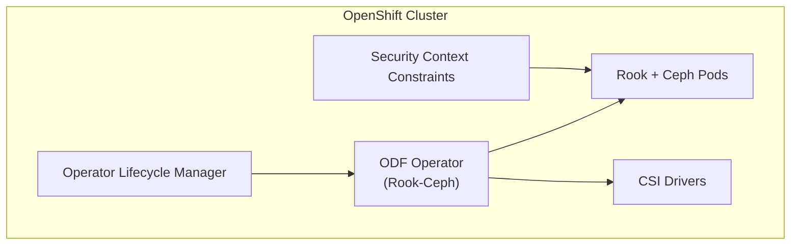

# How to Use Rook-Ceph with OpenShift

Author: [nawazdhandala](https://www.github.com/nawazdhandala)

Tags: Rook, Ceph, Kubernetes, OpenShift, Storage, OCP

Description: Deploy and configure Rook-Ceph on OpenShift, covering Security Context Constraints, OperatorHub installation, and OpenShift Data Foundation integration.

---

## How Rook-Ceph Works on OpenShift

OpenShift enforces stricter security policies than vanilla Kubernetes through Security Context Constraints (SCCs). Running Rook-Ceph on OpenShift requires specific SCCs for the Rook operator, CSI drivers, and Ceph daemon pods. OpenShift also provides the OpenShift Data Foundation (ODF) operator as the official packaging of Rook-Ceph, which handles most of these security requirements automatically.



## Option 1 - Install via OperatorHub (Recommended)

The easiest way to run Rook-Ceph on OpenShift is through the OpenShift Data Foundation operator from OperatorHub.

Navigate to OperatorHub in the OpenShift console, search for "OpenShift Data Foundation", and install it into the `openshift-storage` namespace.

Or install via CLI:

```bash
cat <<EOF | oc apply -f -
apiVersion: operators.coreos.com/v1alpha1
kind: Subscription
metadata:
  name: odf-operator
  namespace: openshift-storage
spec:
  channel: stable-4.16
  name: odf-operator
  source: redhat-operators
  sourceNamespace: openshift-marketplace
EOF
```

## Option 2 - Manual Rook Installation with OpenShift SCCs

If you want to install upstream Rook directly on OpenShift, you must configure SCCs first.

Create the privileged SCC for Rook operator:

```bash
oc adm policy add-scc-to-user privileged \
  system:serviceaccount:rook-ceph:rook-ceph-system
```

Add privileged SCC for the Rook-Ceph default service account:

```bash
oc adm policy add-scc-to-user privileged \
  system:serviceaccount:rook-ceph:default
```

Add `anyuid` SCC for Ceph daemon service accounts:

```bash
oc adm policy add-scc-to-user anyuid \
  system:serviceaccount:rook-ceph:rook-ceph-osd
oc adm policy add-scc-to-user anyuid \
  system:serviceaccount:rook-ceph:rook-ceph-mgr
```

For CSI drivers, add privileged SCC:

```bash
oc adm policy add-scc-to-user privileged \
  system:serviceaccount:rook-ceph:rook-csi-rbd-plugin-sa
oc adm policy add-scc-to-user privileged \
  system:serviceaccount:rook-ceph:rook-csi-cephfs-plugin-sa
```

## Deploying Rook-Ceph on OpenShift

After setting up SCCs, create the namespace and deploy Rook:

```bash
oc create namespace rook-ceph
```

Apply CRDs, common resources, and the operator:

```bash
oc apply --server-side -f crds.yaml
oc apply -f common.yaml
oc apply -f operator-openshift.yaml
```

Rook provides an OpenShift-specific operator file (`operator-openshift.yaml`) that adjusts settings for OCP compatibility. Download it from the Rook releases page.

## OpenShift-Specific CephCluster Configuration

When deploying CephCluster on OpenShift, set the `useAllDevices` setting carefully since OpenShift nodes may have additional devices used by the OS:

```yaml
apiVersion: ceph.rook.io/v1
kind: CephCluster
metadata:
  name: rook-ceph
  namespace: rook-ceph
spec:
  cephVersion:
    image: quay.io/ceph/ceph:v19.2.0
  dataDirHostPath: /var/lib/rook
  mon:
    count: 3
    allowMultiplePerNode: false
  storage:
    useAllNodes: false
    useAllDevices: false
    nodes:
      - name: worker-0
        devices:
          - name: sdb
      - name: worker-1
        devices:
          - name: sdb
      - name: worker-2
        devices:
          - name: sdb
  placement:
    all:
      tolerations:
        - key: node-role.kubernetes.io/master
          operator: Exists
  resources:
    osd:
      requests:
        cpu: "500m"
        memory: "2Gi"
```

## Configuring OpenShift Routes for RGW

To expose the Ceph object store (RGW) on OpenShift, create a Route:

```yaml
apiVersion: route.openshift.io/v1
kind: Route
metadata:
  name: rook-ceph-rgw
  namespace: rook-ceph
spec:
  to:
    kind: Service
    name: rook-ceph-rgw-my-store
  port:
    targetPort: http
  tls:
    termination: edge
    insecureEdgeTerminationPolicy: Redirect
```

Apply it:

```bash
oc apply -f rgw-route.yaml
```

Get the RGW external URL:

```bash
oc get route rook-ceph-rgw -n rook-ceph
```

## Using Rook-Ceph Storage in OpenShift Applications

Create a PVC using Rook-Ceph's StorageClass:

```yaml
apiVersion: v1
kind: PersistentVolumeClaim
metadata:
  name: my-app-data
  namespace: my-app
spec:
  accessModes:
    - ReadWriteOnce
  storageClassName: rook-ceph-block
  resources:
    requests:
      storage: 10Gi
```

For OpenShift DeploymentConfig:

```yaml
apiVersion: apps.openshift.io/v1
kind: DeploymentConfig
metadata:
  name: my-app
spec:
  template:
    spec:
      containers:
        - name: app
          image: nginx
          volumeMounts:
            - mountPath: /data
              name: app-storage
      volumes:
        - name: app-storage
          persistentVolumeClaim:
            claimName: my-app-data
```

## Monitoring Rook-Ceph with OpenShift Monitoring

Enable Ceph metrics scraping in the Rook operator ConfigMap:

```bash
oc -n rook-ceph edit configmap rook-ceph-operator-config
```

Set:

```yaml
data:
  ROOK_ENABLE_DISCOVERY_DAEMON: "true"
```

Create a ServiceMonitor for Ceph metrics (requires the OpenShift monitoring stack):

```yaml
apiVersion: monitoring.coreos.com/v1
kind: ServiceMonitor
metadata:
  name: rook-ceph-mgr
  namespace: rook-ceph
  labels:
    team: rook
spec:
  namespaceSelector:
    matchNames:
      - rook-ceph
  selector:
    matchLabels:
      app: rook-ceph-mgr
  endpoints:
    - port: http-metrics
      path: /metrics
      interval: 15s
```

## Summary

Running Rook-Ceph on OpenShift requires configuring Security Context Constraints for the Rook operator, daemon, and CSI driver service accounts. The recommended approach for production is to use the OpenShift Data Foundation operator through OperatorHub, which handles SCC configuration automatically. For upstream Rook installations, use the OpenShift-specific operator manifest and manually assign privileged and anyuid SCCs. Expose RGW externally using OpenShift Routes, and integrate with OpenShift's monitoring stack using ServiceMonitor resources.
